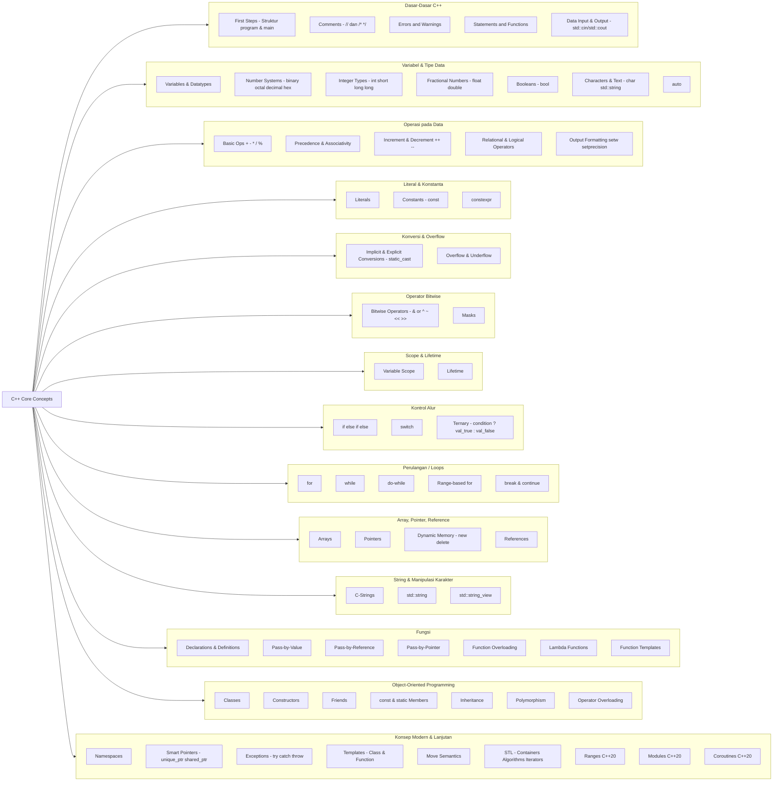

# C++ Core Concepts Cheatsheet





## 1. Dasar-Dasar C++
- **First Steps**: Struktur dasar program C++, fungsi `main`, kompilasi.
- **Comments**: Menulis komentar dengan `//` (single-line) dan `/* */` (multi-line).
- **Errors & Warnings**: Error menghentikan kompilasi, warning menunjukkan potensi masalah.
- **Statements & Functions**: Unit eksekusi dasar dan blok kode reusable.
- **Data Input & Output**: Gunakan `std::cout` untuk output dan `std::cin` untuk input.

## 2. Variabel & Tipe Data
- **Variables & Datatypes**: Deklarasi variabel untuk menyimpan data.
- **Number Systems**: Biner, oktal, desimal, heksadesimal.
- **Integer Types**: `int`, `short`, `long`, `long long`.
- **Fractional Numbers**: `float`, `double`.
- **Booleans**: Tipe `bool` dengan nilai `true`/`false`.
- **Characters & Text**: `char` untuk karakter tunggal, `std::string` untuk teks.
- **`auto`**: Compiler menentukan tipe data secara otomatis.

## 3. Operasi pada Data
- **Basic Operations**: Operator aritmatika (`+`, `-`, `*`, `/`, `%`).
- **Precedence & Associativity**: Urutan eksekusi operator.
- **Increment & Decrement**: Operator `++` dan `--` (prefix dan postfix).
- **Relational & Logical Operators**: Perbandingan (`==`, `!=`, `<`, `>`) dan logika (`&&`, `||`, `!`).
- **Output Formatting**: Atur tampilan output dengan `std::setw`, `std::setprecision`, dll.

## 4. Literal & Konstanta
- **Literals**: Nilai tetap dalam kode (contoh: `10`, `3.14f`, `"Hello"`).
- **Constants**: Variabel yang nilainya tidak bisa diubah setelah inisialisasi (`const`).
- **`constexpr`**: Ekspresi yang nilainya dihitung saat kompilasi.

## 5. Konversi & Overflow
- **Implicit & Explicit Conversions**: Konversi otomatis oleh compiler dan manual (`static_cast`).
- **Overflow & Underflow**: Nilai melebihi batas maksimum/minimum tipe data.

## 6. Operator Bitwise
- **Bitwise Operators**: Operasi level bit (`&`, `|`, `^`, `~`, `<<`, `>>`).
- **Masks**: Isolasi, atur, atau bersihkan bit tertentu menggunakan operator bitwise.

## 7. Scope & Lifetime Variabel
- **Variable Scope**: Area di mana variabel dapat diakses.
- **Lifetime**: Durasi waktu variabel ada di memori.

## 8. Kontrol Alur (Flow Control)
- **`if`, `else if`, `else`**: Eksekusi kondisional.
- **`switch`**: Pilihan berdasarkan nilai integer/enum.
- **Ternary Operator**: Operator kondisional ringkas (`condition ? value_if_true : value_if_false`).

## 9. Perulangan (Loops)
- **`for` loop**: Perulangan dengan inisialisasi, kondisi, dan iterasi.
- **`while` loop**: Perulangan selama kondisi `true`.
- **`do-while` loop**: Dieksekusi minimal sekali.
- **Range-based `for` loop**: Iterasi elemen dalam koleksi (array, `std::vector`).
- **`break` & `continue`**: Hentikan perulangan atau lanjutkan ke iterasi berikutnya.

## 10. Array, Pointer, & Referensi
- **Arrays**: Kumpulan elemen tipe sama dalam memori berurutan.
- **Pointers**: Variabel yang menyimpan alamat memori.
- **Dynamic Memory**: Alokasi memori runtime dengan `new` dan `delete`.
- **References**: Alias untuk variabel yang sudah ada.

## 11. String & Manipulasi Karakter
- **C-Strings**: String gaya C (array `char` dengan null terminator `\0`).
- **`std::string`**: Kelas string modern yang aman dan fleksibel.
- **`std::string_view`**: View non-pemilik ke string untuk efisiensi.

## 12. Fungsi (Functions)
- **Declarations & Definitions**: Deklarasi (prototype) dan definisi (implementasi).
- **Pass-by-Value**: Salin argumen ke parameter.
- **Pass-by-Reference**: Referensi ke argumen asli (bisa dimodifikasi).
- **Pass-by-Pointer**: Berikan alamat memori argumen.
- **Function Overloading**: Fungsi dengan nama sama, parameter berbeda.
- **Lambda Functions**: Fungsi anonim inline.
- **Function Templates**: Fungsi generik untuk berbagai tipe data.

## 13. Object-Oriented Programming (OOP)
- **Classes**: Blueprint untuk objek (gabung data dan perilaku).
- **Constructors**: Fungsi khusus saat objek dibuat.
- **Friends**: Akses member `private`/`protected` dari luar kelas.
- **`const` and `static` Members**: `const` tidak bisa diubah, `static` dibagi semua instance.
- **Inheritance**: Kelas turunan mewarisi dari kelas dasar.
- **Polymorphism**: Objek ambil banyak bentuk via `virtual functions`.
- **Operator Overloading**: Redefinisi operator untuk tipe kustom.

## 14. Konsep Modern & Lanjutan
- **Namespaces**: Hindari konflik penamaan dengan pengelompokan kode.
- **Smart Pointers**: Manajemen memori otomatis (`std::unique_ptr`, `std::shared_ptr`).
- **Exceptions**: Penanganan error runtime (`try`, `catch`, `throw`).
- **Templates (Class & Function)**: Kerangka untuk kelas/fungsi generik.
- **Move Semantics**: Optimasi dengan "memindahkan" sumber daya, bukan menyalin.
- **STL (Standard Template Library)**:
  - **Containers**: `std::vector`, `std::map`, `std::list`, dll.
  - **Algorithms**: Sorting, searching, transformasi.
  - **Iterators**: Telusuri elemen dalam container.
- **Ranges (C++20)**: Cara ekspresif untuk bekerja dengan sekuens data.
- **Modules (C++20)**: Alternatif modern untuk `#include`, tingkatkan kompilasi dan enkapsulasi.
- **Coroutines (C++20)**: Fungsi yang bisa ditunda/dilanjutkan untuk pemrograman asinkron.


# C++ Core Concepts dengan Contoh Kode

Panduan belajar lengkap dengan contoh praktis untuk setiap konsep inti C++.

## 1. Dasar-Dasar C++

### First Steps
```cpp
#include <iostream>

int main() {
    std::cout << "Hello, World!" << std::endl;
    return 0;
}
```

### Comments
```cpp
// Ini adalah komentar satu baris

/*
   Ini adalah komentar
   multi-baris
*/

int age = 25; // Komentar di akhir baris
```

### Errors & Warnings
```cpp
// ERROR - akan gagal kompilasi:
// int x = "hello";  // Type mismatch

// WARNING - masih bisa kompilasi tapi berbahaya:
int uninitializedVar;  // Variable tidak diinisialisasi
std::cout << uninitializedVar;  // Undefined behavior
```

### Statements & Functions
```cpp
#include <iostream>

// Function declaration
int tambah(int a, int b);

int main() {
    int hasil = tambah(5, 3);  // Statement
    std::cout << "Hasil: " << hasil << std::endl;
    return 0;
}

// Function definition
int tambah(int a, int b) {
    return a + b;
}
```

### Data Input & Output
```cpp
#include <iostream>
#include <string>

int main() {
    std::string nama;
    int umur;
    
    std::cout << "Masukkan nama: ";
    std::cin >> nama;
    
    std::cout << "Masukkan umur: ";
    std::cin >> umur;
    
    std::cout << "Halo " << nama << ", umur " << umur << " tahun" << std::endl;
    return 0;
}
```

## 2. Variabel & Tipe Data

### Variables & Datatypes
```cpp
#include <iostream>
#include <string>

int main() {
    // Integer
    int angka = 42;
    
    // Floating point
    double desimal = 3.14159;
    
    // Boolean
    bool aktif = true;
    
    // Character
    char huruf = 'A';
    
    // String
    std::string teks = "Hello C++";
    
    std::cout << "Angka: " << angka << std::endl;
    std::cout << "Desimal: " << desimal << std::endl;
    std::cout << "Aktif: " << aktif << std::endl;
    std::cout << "Huruf: " << huruf << std::endl;
    std::cout << "Teks: " << teks << std::endl;
    
    return 0;
}
```

### Number Systems
```cpp
#include <iostream>

int main() {
    int decimal = 255;        // Basis 10
    int binary = 0b11111111;  // Basis 2 (C++14)
    int octal = 0377;         // Basis 8
    int hex = 0xFF;           // Basis 16
    
    std::cout << "Decimal: " << decimal << std::endl;
    std::cout << "Binary: " << binary << std::endl;
    std::cout << "Octal: " << octal << std::endl;
    std::cout << "Hex: " << hex << std::endl;
    
    return 0;
}
```

### Integer Types
```cpp
#include <iostream>
#include <climits>

int main() {
    short s = 32000;
    int i = 2000000000;
    long l = 2000000000L;
    long long ll = 9000000000000000000LL;
    
    std::cout << "Short: " << s << " (range: " << SHRT_MIN << " to " << SHRT_MAX << ")" << std::endl;
    std::cout << "Int: " << i << " (range: " << INT_MIN << " to " << INT_MAX << ")" << std::endl;
    std::cout << "Long: " << l << std::endl;
    std::cout << "Long long: " << ll << std::endl;
    
    return 0;
}
```

### Fractional Numbers
```cpp
#include <iostream>
#include <iomanip>

int main() {
    float f = 3.14159f;       // 32-bit precision
    double d = 3.141592653589793; // 64-bit precision
    long double ld = 3.141592653589793238L; // Extended precision
    
    std::cout << std::fixed << std::setprecision(15);
    std::cout << "Float: " << f << std::endl;
    std::cout << "Double: " << d << std::endl;
    std::cout << "Long double: " << ld << std::endl;
    
    return 0;
}
```

### Booleans
```cpp
#include <iostream>

int main() {
    bool isTrue = true;
    bool isFalse = false;
    
    // Boolean dari ekspresi
    bool result = (5 > 3);
    
    std::cout << std::boolalpha;  // Tampilkan true/false bukan 1/0
    std::cout << "isTrue: " << isTrue << std::endl;
    std::cout << "isFalse: " << isFalse << std::endl;
    std::cout << "5 > 3: " << result << std::endl;
    
    return 0;
}
```

### Characters & Text
```cpp
#include <iostream>
#include <string>

int main() {
    // Character
    char ch = 'A';
    char newline = '\n';
    char tab = '\t';
    
    // String
    std::string greeting = "Hello";
    std::string name = "World";
    std::string message = greeting + ", " + name + "!";
    
    std::cout << "Character: " << ch << std::endl;
    std::cout << "Message: " << message << std::endl;
    std::cout << "Length: " << message.length() << std::endl;
    
    return 0;
}
```

### Auto
```cpp
#include <iostream>
#include <vector>
#include <string>

int main() {
    auto number = 42;           // int
    auto decimal = 3.14;        // double
    auto text = "Hello";        // const char*
    auto message = std::string("World"); // std::string
    
    std::vector<int> numbers = {1, 2, 3, 4, 5};
    
    // Berguna untuk tipe yang kompleks
    for (auto it = numbers.begin(); it != numbers.end(); ++it) {
        std::cout << *it << " ";
    }
    std::cout << std::endl;
    
    return 0;
}
```

## 3. Operasi pada Data

### Basic Operations
```cpp
#include <iostream>

int main() {
    int a = 10, b = 3;
    
    std::cout << "a + b = " << (a + b) << std::endl;  // Penjumlahan
    std::cout << "a - b = " << (a - b) << std::endl;  // Pengurangan
    std::cout << "a * b = " << (a * b) << std::endl;  // Perkalian
    std::cout << "a / b = " << (a / b) << std::endl;  // Pembagian (integer)
    std::cout << "a % b = " << (a % b) << std::endl;  // Modulo (sisa bagi)
    
    double x = 10.0, y = 3.0;
    std::cout << "x / y = " << (x / y) << std::endl;  // Pembagian (floating point)
    
    return 0;
}
```

### Precedence & Associativity
```cpp
#include <iostream>

int main() {
    int result1 = 2 + 3 * 4;     // = 14 (bukan 20)
    int result2 = (2 + 3) * 4;   // = 20
    
    int a = 10;
    int result3 = a = 5 + 3;     // a = 8, result3 = 8 (right-to-left associativity)
    
    std::cout << "2 + 3 * 4 = " << result1 << std::endl;
    std::cout << "(2 + 3) * 4 = " << result2 << std::endl;
    std::cout << "a = 5 + 3, result = " << result3 << ", a = " << a << std::endl;
    
    return 0;
}
```

### Increment & Decrement
```cpp
#include <iostream>

int main() {
    int a = 5;
    
    std::cout << "a = " << a << std::endl;        // 5
    std::cout << "++a = " << ++a << std::endl;    // 6 (pre-increment)
    std::cout << "a++ = " << a++ << std::endl;    // 6 (post-increment, lalu a menjadi 7)
    std::cout << "a = " << a << std::endl;        // 7
    
    std::cout << "--a = " << --a << std::endl;    // 6 (pre-decrement)
    std::cout << "a-- = " << a-- << std::endl;    // 6 (post-decrement, lalu a menjadi 5)
    std::cout << "a = " << a << std::endl;        // 5
    
    return 0;
}
```

### Relational & Logical Operators
```cpp
#include <iostream>

int main() {
    int x = 10, y = 5;
    bool a = true, b = false;
    
    // Relational operators
    std::cout << std::boolalpha;
    std::cout << "x == y: " << (x == y) << std::endl;  // false
    std::cout << "x != y: " << (x != y) << std::endl;  // true
    std::cout << "x > y: " << (x > y) << std::endl;    // true
    std::cout << "x < y: " << (x < y) << std::endl;    // false
    std::cout << "x >= y: " << (x >= y) << std::endl;  // true
    std::cout << "x <= y: " << (x <= y) << std::endl;  // false
    
    // Logical operators
    std::cout << "a && b: " << (a && b) << std::endl;  // false (AND)
    std::cout << "a || b: " << (a || b) << std::endl;  // true (OR)
    std::cout << "!a: " << (!a) << std::endl;          // false (NOT)
    
    return 0;
}
```

### Output Formatting
```cpp
#include <iostream>
#include <iomanip>

int main() {
    double pi = 3.141592653589793;
    int number = 42;
    
    // Precision
    std::cout << std::fixed << std::setprecision(2) << pi << std::endl; // 3.14
    
    // Width and alignment
    std::cout << std::setw(10) << number << std::endl;                  // "        42"
    std::cout << std::left << std::setw(10) << number << "end" << std::endl; // "42        end"
    
    // Fill character
    std::cout << std::setfill('0') << std::setw(5) << number << std::endl; // "00042"
    
    // Hex and octal
    std::cout << std::hex << number << std::endl;  // 2a
    std::cout << std::oct << number << std::endl;  // 52
    std::cout << std::dec << number << std::endl;  // 42
    
    return 0;
}
```

## 4. Literal & Konstanta

### Literals
```cpp
#include <iostream>

int main() {
    // Integer literals
    int dec = 42;
    int hex = 0x2A;
    int oct = 052;
    int bin = 0b101010;
    
    // Floating point literals
    float f = 3.14f;
    double d = 3.14;
    long double ld = 3.14L;
    
    // Character literals
    char ch = 'A';
    char newline = '\n';
    char unicode = '\x41';  // 'A' in hex
    
    // String literals
    const char* cstr = "Hello";
    std::string str = "World";
    
    std::cout << "All literals work as expected!" << std::endl;
    
    return 0;
}
```

### Constants
```cpp
#include <iostream>

int main() {
    const int MAX_SIZE = 100;
    const double PI = 3.141592653589793;
    const std::string GREETING = "Hello, World!";
    
    // MAX_SIZE = 200;  // ERROR: cannot modify const
    
    std::cout << "Max size: " << MAX_SIZE << std::endl;
    std::cout << "Pi: " << PI << std::endl;
    std::cout << "Greeting: " << GREETING << std::endl;
    
    return 0;
}
```

### Constexpr
```cpp
#include <iostream>

// Constexpr function - computed at compile time
constexpr int factorial(int n) {
    return (n <= 1) ? 1 : n * factorial(n - 1);
}

constexpr int square(int x) {
    return x * x;
}

int main() {
    constexpr int SIZE = 10;                    // Compile-time constant
    constexpr int FACT_5 = factorial(5);       // Computed at compile time
    constexpr int SQ_7 = square(7);            // Computed at compile time
    
    std::cout << "Size: " << SIZE << std::endl;
    std::cout << "5! = " << FACT_5 << std::endl;
    std::cout << "7^2 = " << SQ_7 << std::endl;
    
    return 0;
}
```

## 5. Konversi & Overflow

### Implicit & Explicit Conversions
```cpp
#include <iostream>

int main() {
    // Implicit conversion
    int i = 42;
    double d = i;           // int -> double (implicit)
    char c = 65;            // int -> char (implicit, but potentially dangerous)
    
    // Explicit conversion (C++ style casts)
    double pi = 3.14159;
    int truncated = static_cast<int>(pi);  // 3 (truncated, not rounded)
    
    // Old C-style cast (not recommended)
    int old_style = (int)pi;
    
    std::cout << "i = " << i << ", d = " << d << std::endl;
    std::cout << "c = " << c << " (ASCII: " << static_cast<int>(c) << ")" << std::endl;
    std::cout << "pi = " << pi << ", truncated = " << truncated << std::endl;
    
    return 0;
}
```

### Overflow & Underflow
```cpp
#include <iostream>
#include <climits>

int main() {
    // Integer overflow
    int max_int = INT_MAX;
    std::cout << "INT_MAX = " << max_int << std::endl;
    std::cout << "INT_MAX + 1 = " << max_int + 1 << std::endl;  // Undefined behavior
    
    // Unsigned overflow (well-defined: wraps around)
    unsigned int max_uint = UINT_MAX;
    std::cout << "UINT_MAX = " << max_uint << std::endl;
    std::cout << "UINT_MAX + 1 = " << max_uint + 1 << std::endl;  // Wraps to 0
    
    // Underflow
    unsigned int min_uint = 0;
    std::cout << "0 - 1 (unsigned) = " << min_uint - 1 << std::endl;  // Wraps to UINT_MAX
    
    return 0;
}
```

## 6. Operator Bitwise

### Bitwise Operators
```cpp
#include <iostream>
#include <bitset>

int main() {
    unsigned char a = 0b11001010;  // 202
    unsigned char b = 0b01010110;  // 86
    
    std::cout << "a = " << std::bitset<8>(a) << " (" << static_cast<int>(a) << ")" << std::endl;
    std::cout << "b = " << std::bitset<8>(b) << " (" << static_cast<int>(b) << ")" << std::endl;
    
    std::cout << "a & b = " << std::bitset<8>(a & b) << " (AND)" << std::endl;
    std::cout << "a | b = " << std::bitset<8>(a | b) << " (OR)" << std::endl;
    std::cout << "a ^ b = " << std::bitset<8>(a ^ b) << " (XOR)" << std::endl;
    std::cout << "~a = " << std::bitset<8>(~a) << " (NOT)" << std::endl;
    std::cout << "a << 2 = " << std::bitset<8>(a << 2) << " (Left shift)" << std::endl;
    std::cout << "a >> 2 = " << std::bitset<8>(a >> 2) << " (Right shift)" << std::endl;
    
    return 0;
}
```

### Masks
```cpp
#include <iostream>
#include <bitset>

int main() {
    unsigned char flags = 0b00000000;
    
    // Bit masks
    const unsigned char MASK_BIT0 = 0b00000001;  // Bit 0
    const unsigned char MASK_BIT3 = 0b00001000;  // Bit 3
    const unsigned char MASK_BIT7 = 0b10000000;  // Bit 7
    
    std::cout << "Initial flags: " << std::bitset<8>(flags) << std::endl;
    
    // Set bits
    flags |= MASK_BIT0;   // Set bit 0
    flags |= MASK_BIT3;   // Set bit 3
    std::cout << "After setting bits 0 and 3: " << std::bitset<8>(flags) << std::endl;
    
    // Check if bit is set
    if (flags & MASK_BIT0) {
        std::cout << "Bit 0 is set" << std::endl;
    }
    
    // Clear bit
    flags &= ~MASK_BIT0;  // Clear bit 0
    std::cout << "After clearing bit 0: " << std::bitset<8>(flags) << std::endl;
    
    // Toggle bit
    flags ^= MASK_BIT7;   // Toggle bit 7
    std::cout << "After toggling bit 7: " << std::bitset<8>(flags) << std::endl;
    
    return 0;
}
```

## 7. Scope & Lifetime Variabel

### Variable Scope
```cpp
#include <iostream>

int global_var = 100;  // Global scope

void function() {
    int local_var = 200;  // Function scope
    std::cout << "Inside function - global_var: " << global_var << std::endl;
    std::cout << "Inside function - local_var: " << local_var << std::endl;
}

int main() {
    int main_var = 300;   // Function scope (main)
    
    {
        int block_var = 400;  // Block scope
        std::cout << "Inside block - main_var: " << main_var << std::endl;
        std::cout << "Inside block - block_var: " << block_var << std::endl;
    }
    
    // std::cout << block_var;  // ERROR: block_var not in scope
    
    function();
    // std::cout << local_var;  // ERROR: local_var not in scope
    
    return 0;
}
```

### Lifetime
```cpp
#include <iostream>

class Demo {
public:
    Demo(const std::string& name) : name_(name) {
        std::cout << "Constructor: " << name_ << std::endl;
    }
    
    ~Demo() {
        std::cout << "Destructor: " << name_ << std::endl;
    }
    
private:
    std::string name_;
};

void function() {
    Demo local_obj("Local");
    // local_obj destroyed when function ends
}

int main() {
    Demo main_obj("Main");
    
    {
        Demo block_obj("Block");
        // block_obj destroyed when block ends
    }
    
    function();
    
    // main_obj destroyed when main ends
    return 0;
}
```

## 8. Kontrol Alur (Flow Control)

### If, Else If, Else
```cpp
#include <iostream>

int main() {
    int score = 85;
    
    if (score >= 90) {
        std::cout << "Grade: A" << std::endl;
    } else if (score >= 80) {
        std::cout << "Grade: B" << std::endl;
    } else if (score >= 70) {
        std::cout << "Grade: C" << std::endl;
    } else if (score >= 60) {
        std::cout << "Grade: D" << std::endl;
    } else {
        std::cout << "Grade: F" << std::endl;
    }
    
    return 0;
}
```

### Switch
```cpp
#include <iostream>

int main() {
    int day = 3;
    
    switch (day) {
        case 1:
            std::cout << "Monday" << std::endl;
            break;
        case 2:
            std::cout << "Tuesday" << std::endl;
            break;
        case 3:
            std::cout << "Wednesday" << std::endl;
            break;
        case 4:
            std::cout << "Thursday" << std::endl;
            break;
        case 5:
            std::cout << "Friday" << std::endl;
            break;
        case 6:
        case 7:
            std::cout << "Weekend" << std::endl;
            break;
        default:
            std::cout << "Invalid day" << std::endl;
    }
    
    return 0;
}
```

### Ternary Operator
```cpp
#include <iostream>

int main() {
    int a = 10, b = 20;
    
    // Basic ternary
    int max = (a > b) ? a : b;
    std::cout << "Max: " << max << std::endl;
    
    // Nested ternary (not recommended for readability)
    int x = 5;
    std::string result = (x > 0) ? "positive" : (x < 0) ? "negative" : "zero";
    std::cout << "Number is: " << result << std::endl;
    
    // Ternary in function call
    std::cout << "Absolute value of -15: " << ((-15 < 0) ? -(-15) : (-15)) << std::endl;
    
    return 0;
}
```

## 9. Perulangan (Loops)

### For Loop
```cpp
#include <iostream>

int main() {
    // Basic for loop
    std::cout << "Basic for loop:" << std::endl;
    for (int i = 0; i < 5; i++) {
        std::cout << i << " ";
    }
    std::cout << std::endl;
    
    // Multiple variables
    std::cout << "Multiple variables:" << std::endl;
    for (int i = 0, j = 10; i < 5; i++, j--) {
        std::cout << "i=" << i << ", j=" << j << std::endl;
    }
    
    // Empty parts
    int k = 0;
    for (; k < 3;) {
        std::cout << "k=" << k << std::endl;
        k++;
    }
    
    return 0;
}
```

### While Loop
```cpp
#include <iostream>

int main() {
    // Basic while loop
    int count = 0;
    while (count < 5) {
        std::cout << "Count: " << count << std::endl;
        count++;
    }
    
    // Input validation with while
    int number;
    std::cout << "Enter a positive number: ";
    while (std::cin >> number && number <= 0) {
        std::cout << "Please enter a positive number: ";
    }
    std::cout << "You entered: " << number << std::endl;
    
    return 0;
}
```

### Do-While Loop
```cpp
#include <iostream>

int main() {
    int choice;
    
    do {
        std::cout << "\nMenu:" << std::endl;
        std::cout << "1. Option 1" << std::endl;
        std::cout << "2. Option 2" << std::endl;
        std::cout << "3. Exit" << std::endl;
        std::cout << "Enter your choice: ";
        std::cin >> choice;
        
        switch (choice) {
            case 1:
                std::cout << "You selected Option 1" << std::endl;
                break;
            case 2:
                std::cout << "You selected Option 2" << std::endl;
                break;
            case 3:
                std::cout << "Goodbye!" << std::endl;
                break;
            default:
                std::cout << "Invalid choice!" << std::endl;
        }
    } while (choice != 3);
    
    return 0;
}
```

### Range-based For Loop
```cpp
#include <iostream>
#include <vector>
#include <string>

int main() {
    // Array
    int numbers[] = {1, 2, 3, 4, 5};
    std::cout << "Array elements: ";
    for (int num : numbers) {
        std::cout << num << " ";
    }
    std::cout << std::endl;
    
    // Vector
    std::vector<std::string> names = {"Alice", "Bob", "Charlie"};
    std::cout << "Names:" << std::endl;
    for (const std::string& name : names) {
        std::cout << "- " << name << std::endl;
    }
    
    // Modifying elements
    std::vector<int> values = {1, 2, 3, 4, 5};
    for (int& val : values) {
        val *= 2;  // Double each value
    }
    
    std::cout << "Doubled values: ";
    for (int val : values) {
        std::cout << val << " ";
    }
    std::cout << std::endl;
    
    return 0;
}
```

### Break & Continue
```cpp
#include <iostream>

int main() {
    std::cout << "Break example:" << std::endl;
    for (int i = 0; i < 10; i++) {
        if (i == 5) {
            break;  // Exit loop when i == 5
        }
        std::cout << i << " ";
    }
    std::cout << std::endl;
    
    std::cout << "Continue example:" << std::endl;
    for (int i = 0; i < 10; i++) {
        if (i % 2 == 0) {
            continue;  // Skip even numbers
        }
        std::cout << i << " ";
    }
    std::cout << std::endl;
    
    std::cout << "Nested loops with labeled break:" << std::endl;
    for (int i = 0; i < 3; i++) {
        for (int j = 0; j < 3; j++) {
            if (i == 1 && j == 1) {
                std::cout << "\nBreaking inner loop at i=" << i << ", j=" << j << std::endl;
                break;  // Only breaks inner loop
            }
            std::cout << "(" << i << "," << j << ") ";
        }
        std::cout << std::endl;
    }
    
    return 0;
}
```

## 10. Array, Pointer, & Referensi

### Arrays
```cpp
#include <iostream>

int main() {
    // Static array
    int numbers[5] = {10, 20, 30, 40, 50};
    
    // Print array elements
    std::cout << "Array elements: ";
    for (int i = 0; i < 5; i++) {
        std::cout << numbers[i] << " ";
    }
    std::cout << std::endl;
    
    // Array size
    std::cout << "Array size: " << sizeof(numbers) / sizeof(numbers[0]) << std::endl;
    
    // 2D array
    int matrix[3][3] = {
        {1, 2, 3},
        {4, 5, 6},
        {7, 8, 9}
    };
    
    std::cout << "Matrix:" << std::endl;
    for (int i = 0; i < 3; i++) {
        for (int j = 0; j < 3; j++) {
            std::cout << matrix[i][j] << " ";
        }
        std::cout << std::endl;
    }
    
    return 0;
}
```

### Pointers
```cpp
#include <iostream>

int main() {
    int value = 42;
    int* ptr = &value;  // Pointer to value
    
    std::cout << "Value: " << value << std::endl;
    std::cout << "Address of value: " << &value << std::endl;
    std::cout << "Pointer: " << ptr << std::endl;
    std::cout << "Value through pointer: " << *ptr << std::endl;
    
    // Modify through pointer
    *ptr = 100;
    std::cout << "After modification through pointer: " << value << std::endl;
    
    // Pointer arithmetic with arrays
    int arr[] = {10, 20, 30, 40, 50};
    int* arrPtr = arr;  // arr is equivalent to &arr[0]
    
    std::cout << "Array through pointer arithmetic:" << std::endl;
    for (int i = 0; i < 5; i++) {
        std::cout << "arr[" << i << "] = " << *(arrPtr + i) << std::endl;
    }
    
    return 0;
}
```

### Dynamic Memory
```cpp
#include <iostream>

int main() {
    // Single value
    int* ptr = new int(42);
    std::cout << "Dynamic value: " << *ptr << std::endl;
    delete ptr;  // Don't forget to free memory!
    
    // Dynamic array
    int size = 5;
    int* arr = new int[size];
    
    // Initialize array
    for (int i = 0; i < size; i++) {
        arr[i] = i * 10;
    }
    
    std::cout << "Dynamic array: ";
    for (int i = 0; i < size; i++) {
        std::cout << arr[i] << " ";
    }
    std::cout << std::endl;
    
    delete[] arr;  // Use delete[] for arrays
    
    return 0;
}
```

### References
```cpp
#include <iostream>

void modifyByValue(int x) {
    x = 100;  // Only modifies local copy
}

void modifyByReference(int& x) {
    x = 100;  // Modifies original variable
}

void modifyByPointer(int* x) {
    *x = 100;  // Modifies original variable through pointer
}

int main() {
    int original = 42;
    
    std::cout << "Original value: " << original << std::endl;
    
    // Reference (alias)
    int& ref = original;
    std::cout << "Reference: " << ref << std::endl;
    
    ref = 50;  // Modifies original through reference
    std::cout << "After modifying through reference: " << original << std::endl;
    
    // Function calls
    int value1 = 10, value2 = 20, value3 = 30;
    
    modifyByValue(value1);
    std::cout << "After modifyByValue: " << value1 << std::endl;  // Still 10
    
    modifyByReference(value2);
    std::cout << "After modifyByReference: " << value2 << std::endl;  // Now 100
    
    modifyByPointer(&value3);
    std::cout << "After modifyByPointer: " << value3 << std::endl;  // Now 100
    
    return 0;
}
```

## 11. String & Manipulasi Karakter

### C-Strings
```cpp
#include <iostream>
#include <cstring>

int main() {
    // C-string declaration
    char greeting[] = "Hello";
    char name[20];
    
    // String functions
    std::cout << "Length of greeting: " << strlen(greeting) << std::endl;
    
    strcpy(name, "World");
    std::cout << "Name: " << name << std::endl;
    
    strcat(greeting, " ");
    strcat(greeting, name);
    std::cout << "Combined: " << greeting << std::endl;
    
    // String comparison
    if (strcmp(greeting, "Hello World") == 0) {
        std::cout << "Strings are equal!" << std::endl;
    }
    
    return 0;
}
```

### std::string
```cpp
#include <iostream>
#include <string>

int main() {
    // String creation
    std::string str1 = "Hello";
    std::string str2("World");
    std::string str3(5, 'A');  // "AAAAA"
    
    // String operations
    std::string combined = str1 + " " + str2;
    std::cout << "Combined: " << combined << std::endl;
    std::cout << "Length: " << combined.length() << std::endl;
    
    // Access characters
    std::cout << "First character: " << combined[0] << std::endl;
    std::cout << "Last character: " << combined.back() << std::endl;
    
    // Substring
    std::string sub = combined.substr(0, 5);  // "Hello"
    std::cout << "Substring: " << sub << std::endl;
    
    // Find
    size_t pos = combined.find("World");
    if (pos != std::string::npos) {
        std::cout << "Found 'World' at position: " << pos << std::endl;
    }
    
    // Replace
    std::string replaced = combined;
    replaced.replace(pos, 5, "C++");
    std::cout << "Replaced: " << replaced << std::endl;
    
    // String comparison
    if (str1 == "Hello") {
        std::cout << "String comparison works!" << std::endl;
    }
    
    return 0;
}
```

### std::string_view (C++17)
```cpp
#include <iostream>
#include <string_view>

void printString(std::string_view sv) {
    std::cout << "String view: " << sv << std::endl;
}

int main() {
    // Works with different string types without copying
    std::string str = "Hello World";
    const char* cstr = "C-style string";
    
    printString(str);           // std::string
    printString(cstr);          // const char*
    printString("literal");     // string literal
    
    // Substring without copying
    std::string_view view = str;
    std::string_view sub = view.substr(0, 5);
    std::cout << "Substring view: " << sub << std::endl;
    
    return 0;
}
```

## 12. Fungsi (Functions)

### Declarations & Definitions
```cpp
#include <iostream>

// Function declaration (prototype)
int add(int a, int b);
void greet(const std::string& name);
double calculateArea(double radius);

int main() {
    int result = add(5, 3);
    std::cout << "5 + 3 = " << result << std::endl;
    
    greet("Alice");
    
    double area = calculateArea(5.0);
    std::cout << "Area of circle with radius 5: " << area << std::endl;
    
    return 0;
}

// Function definitions
int add(int a, int b) {
    return a + b;
}

void greet(const std::string& name) {
    std::cout << "Hello, " << name << "!" << std::endl;
}

double calculateArea(double radius) {
    const double PI = 3.14159;
    return PI * radius * radius;
}
```

### Pass-by-Value, Reference, Pointer
```cpp
#include <iostream>

// Pass by value - makes a copy
void passByValue(int x) {
    x = 100;
    std::cout << "Inside passByValue: " << x << std::endl;
}

// Pass by reference - works with original
void passByReference(int& x) {
    x = 200;
    std::cout << "Inside passByReference: " << x << std::endl;
}

// Pass by const reference - read-only access to original
void passByConstReference(const std::string& str) {
    std::cout << "String length: " << str.length() << std::endl;
    // str = "modified";  // ERROR: cannot modify const reference
}

// Pass by pointer - works with original through address
void passByPointer(int* x) {
    if (x != nullptr) {
        *x = 300;
        std::cout << "Inside passByPointer: " << *x << std::endl;
    }
}

int main() {
    int value = 10;
    std::string text = "Hello World";
    
    std::cout << "Original value: " << value << std::endl;
    
    passByValue(value);
    std::cout << "After passByValue: " << value << std::endl;  // Still 10
    
    passByReference(value);
    std::cout << "After passByReference: " << value << std::endl;  // Now 200
    
    passByConstReference(text);
    
    passByPointer(&value);
    std::cout << "After passByPointer: " << value << std::endl;  // Now 300
    
    return 0;
}
```

### Function Overloading
```cpp
#include <iostream>
#include <string>

// Different number of parameters
int add(int a, int b) {
    return a + b;
}

int add(int a, int b, int c) {
    return a + b + c;
}

// Different parameter types
double add(double a, double b) {
    return a + b;
}

std::string add(const std::string& a, const std::string& b) {
    return a + b;
}

// Default parameters
void greet(const std::string& name, const std::string& greeting = "Hello") {
    std::cout << greeting << ", " << name << "!" << std::endl;
}

int main() {
    std::cout << "add(5, 3): " << add(5, 3) << std::endl;
    std::cout << "add(1, 2, 3): " << add(1, 2, 3) << std::endl;
    std::cout << "add(2.5, 3.7): " << add(2.5, 3.7) << std::endl;
    std::cout << "add(\"Hello\", \" World\"): " << add(std::string("Hello"), std::string(" World")) << std::endl;
    
    greet("Alice");                    // Uses default greeting
    greet("Bob", "Hi");               // Uses custom greeting
    
    return 0;
}
```

### Lambda Functions
```cpp
#include <iostream>
#include <vector>
#include <algorithm>

int main() {
    // Basic lambda
    auto greet = []() {
        std::cout << "Hello from lambda!" << std::endl;
    };
    greet();
    
    // Lambda with parameters
    auto add = [](int a, int b) {
        return a + b;
    };
    std::cout << "5 + 3 = " << add(5, 3) << std::endl;
    
    // Lambda with capture
    int multiplier = 10;
    auto multiply = [multiplier](int x) {
        return x * multiplier;
    };
    std::cout << "7 * 10 = " << multiply(7) << std::endl;
    
    // Lambda with mutable capture
    int counter = 0;
    auto increment = [counter]() mutable {
        return ++counter;
    };
    std::cout << "Counter: " << increment() << ", " << increment() << std::endl;
    std::cout << "Original counter: " << counter << std::endl;  // Still 0
    
    // Lambda with reference capture
    auto incrementRef = [&counter]() {
        return ++counter;
    };
    std::cout << "Counter with ref: " << incrementRef() << ", " << incrementRef() << std::endl;
    std::cout << "Original counter now: " << counter << std::endl;  // Now 2
    
    // Using lambda with STL algorithms
    std::vector<int> numbers = {1, 2, 3, 4, 5};
    
    // Transform each element
    std::transform(numbers.begin(), numbers.end(), numbers.begin(),
                   [](int x) { return x * x; });
    
    std::cout << "Squared numbers: ";
    for (int n : numbers) {
        std::cout << n << " ";
    }
    std::cout << std::endl;
    
    return 0;
}
```

### Function Templates
```cpp
#include <iostream>
#include <string>

// Template function
template<typename T>
T maximum(T a, T b) {
    return (a > b) ? a : b;
}

// Template with multiple types
template<typename T, typename U>
auto add(T a, U b) -> decltype(a + b) {
    return a + b;
}

// Template with non-type parameter
template<typename T, int N>
void printArray(T (&arr)[N]) {
    std::cout << "Array of " << N << " elements: ";
    for (int i = 0; i < N; i++) {
        std::cout << arr[i] << " ";
    }
    std::cout << std::endl;
}

int main() {
    // Template instantiation
    std::cout << "max(5, 3): " << maximum(5, 3) << std::endl;
    std::cout << "max(5.7, 2.1): " << maximum(5.7, 2.1) << std::endl;
    std::cout << "max(\"hello\", \"world\"): " << maximum(std::string("hello"), std::string("world")) << std::endl;
    
    // Mixed types
    std::cout << "add(5, 3.14): " << add(5, 3.14) << std::endl;
    
    // Array template
    int intArr[] = {1, 2, 3, 4, 5};
    double doubleArr[] = {1.1, 2.2, 3.3};
    
    printArray(intArr);
    printArray(doubleArr);
    
    return 0;
}
```

## 13. Object-Oriented Programming (OOP)

### Classes
```cpp
#include <iostream>
#include <string>

class Rectangle {
private:
    double width, height;
    
public:
    // Constructor
    Rectangle(double w, double h) : width(w), height(h) {}
    
    // Member functions
    double getArea() const {
        return width * height;
    }
    
    double getPerimeter() const {
        return 2 * (width + height);
    }
    
    // Getter and setter
    double getWidth() const { return width; }
    void setWidth(double w) { width = w; }
    
    double getHeight() const { return height; }
    void setHeight(double h) { height = h; }
    
    // Display function
    void display() const {
        std::cout << "Rectangle: " << width << " x " << height 
                  << ", Area: " << getArea() << std::endl;
    }
};

int main() {
    Rectangle rect(5.0, 3.0);
    rect.display();
    
    std::cout << "Perimeter: " << rect.getPerimeter() << std::endl;
    
    rect.setWidth(7.0);
    rect.display();
    
    return 0;
}
```

### Constructors
```cpp
#include <iostream>
#include <string>

class Student {
private:
    std::string name;
    int age;
    double gpa;
    
public:
    // Default constructor
    Student() : name("Unknown"), age(0), gpa(0.0) {
        std::cout << "Default constructor called" << std::endl;
    }
    
    // Parameterized constructor
    Student(const std::string& n, int a) : name(n), age(a), gpa(0.0) {
        std::cout << "Parameterized constructor called for " << name << std::endl;
    }
    
    // Constructor with all parameters
    Student(const std::string& n, int a, double g) : name(n), age(a), gpa(g) {
        std::cout << "Full constructor called for " << name << std::endl;
    }
    
    // Copy constructor
    Student(const Student& other) : name(other.name), age(other.age), gpa(other.gpa) {
        std::cout << "Copy constructor called for " << name << std::endl;
    }
    
    // Destructor
    ~Student() {
        std::cout << "Destructor called for " << name << std::endl;
    }
    
    void display() const {
        std::cout << "Student: " << name << ", Age: " << age << ", GPA: " << gpa << std::endl;
    }
};

int main() {
    Student s1;                           // Default constructor
    Student s2("Alice", 20);              // Parameterized constructor
    Student s3("Bob", 21, 3.8);          // Full constructor
    Student s4 = s3;                     // Copy constructor
    
    s1.display();
    s2.display();
    s3.display();
    s4.display();
    
    return 0;
}
```

### Friends
```cpp
#include <iostream>

class Box {
private:
    double width, height, depth;
    
public:
    Box(double w, double h, double d) : width(w), height(h), depth(d) {}
    
    // Friend function declaration
    friend double calculateVolume(const Box& box);
    friend class BoxPrinter;
    
    double getWidth() const { return width; }
};

// Friend function definition
double calculateVolume(const Box& box) {
    // Can access private members directly
    return box.width * box.height * box.depth;
}

// Friend class
class BoxPrinter {
public:
    void printDimensions(const Box& box) {
        // Can access private members of Box
        std::cout << "Dimensions: " << box.width << " x " 
                  << box.height << " x " << box.depth << std::endl;
    }
};

int main() {
    Box myBox(3.0, 4.0, 5.0);
    
    std::cout << "Volume: " << calculateVolume(myBox) << std::endl;
    
    BoxPrinter printer;
    printer.printDimensions(myBox);
    
    return 0;
}
```

### Const and Static Members
```cpp
#include <iostream>

class Counter {
private:
    static int objectCount;     // Static member variable
    const int id;              // Const member variable
    int value;
    
public:
    // Constructor with initializer list for const member
    Counter(int initialValue = 0) : id(++objectCount), value(initialValue) {
        std::cout << "Counter " << id << " created" << std::endl;
    }
    
    ~Counter() {
        std::cout << "Counter " << id << " destroyed" << std::endl;
        objectCount--;
    }
    
    // Const member function - cannot modify object state
    int getValue() const {
        return value;
    }
    
    int getId() const {
        return id;
    }
    
    // Non-const member function
    void increment() {
        value++;
    }
    
    // Static member function - can only access static members
    static int getObjectCount() {
        return objectCount;
    }
    
    // Static const member
    static const int MAX_VALUE = 1000;
};

// Static member definition
int Counter::objectCount = 0;

int main() {
    std::cout << "Initial object count: " << Counter::getObjectCount() << std::endl;
    
    Counter c1(10);
    Counter c2(20);
    Counter c3;
    
    std::cout << "Object count: " << Counter::getObjectCount() << std::endl;
    std::cout << "Max value: " << Counter::MAX_VALUE << std::endl;
    
    c1.increment();
    std::cout << "Counter " << c1.getId() << " value: " << c1.getValue() << std::endl;
    
    // Const object - can only call const member functions
    const Counter c4(100);
    std::cout << "Const counter value: " << c4.getValue() << std::endl;
    // c4.increment();  // ERROR: cannot call non-const function on const object
    
    return 0;
}
```

### Inheritance
```cpp
#include <iostream>
#include <string>

// Base class
class Animal {
protected:
    std::string name;
    int age;
    
public:
    Animal(const std::string& n, int a) : name(n), age(a) {
        std::cout << "Animal constructor: " << name << std::endl;
    }
    
    virtual ~Animal() {
        std::cout << "Animal destructor: " << name << std::endl;
    }
    
    virtual void makeSound() const {
        std::cout << name << " makes a sound" << std::endl;
    }
    
    virtual void move() const {
        std::cout << name << " moves" << std::endl;
    }
    
    void eat() const {
        std::cout << name << " is eating" << std::endl;
    }
    
    std::string getName() const { return name; }
    int getAge() const { return age; }
};

// Derived class
class Dog : public Animal {
private:
    std::string breed;
    
public:
    Dog(const std::string& n, int a, const std::string& b) 
        : Animal(n, a), breed(b) {
        std::cout << "Dog constructor: " << name << std::endl;
    }
    
    ~Dog() {
        std::cout << "Dog destructor: " << name << std::endl;
    }
    
    // Override virtual function
    void makeSound() const override {
        std::cout << name << " barks: Woof!" << std::endl;
    }
    
    void move() const override {
        std::cout << name << " runs on four legs" << std::endl;
    }
    
    // Additional function specific to Dog
    void fetch() const {
        std::cout << name << " fetches the ball" << std::endl;
    }
    
    std::string getBreed() const { return breed; }
};

class Cat : public Animal {
public:
    Cat(const std::string& n, int a) : Animal(n, a) {
        std::cout << "Cat constructor: " << name << std::endl;
    }
    
    ~Cat() {
        std::cout << "Cat destructor: " << name << std::endl;
    }
    
    void makeSound() const override {
        std::cout << name << " meows: Meow!" << std::endl;
    }
    
    void move() const override {
        std::cout << name << " prowls silently" << std::endl;
    }
    
    void climb() const {
        std::cout << name << " climbs a tree" << std::endl;
    }
};

int main() {
    Dog myDog("Buddy", 3, "Golden Retriever");
    Cat myCat("Whiskers", 2);
    
    std::cout << "\n--- Direct calls ---" << std::endl;
    myDog.makeSound();
    myDog.move();
    myDog.fetch();
    
    myCat.makeSound();
    myCat.move();
    myCat.climb();
    
    std::cout << "\n--- Polymorphism ---" << std::endl;
    Animal* animals[] = {&myDog, &myCat};
    
    for (Animal* animal : animals) {
        animal->makeSound();  // Calls overridden version
        animal->move();       // Calls overridden version
        animal->eat();        // Calls base version
    }
    
    return 0;
}
```

### Polymorphism
```cpp
#include <iostream>
#include <vector>
#include <memory>

// Abstract base class
class Shape {
public:
    virtual ~Shape() = default;
    
    // Pure virtual functions make this an abstract class
    virtual double getArea() const = 0;
    virtual double getPerimeter() const = 0;
    virtual void draw() const = 0;
    
    // Non-virtual function
    void info() const {
        std::cout << "Area: " << getArea() << ", Perimeter: " << getPerimeter() << std::endl;
    }
};

class Circle : public Shape {
private:
    double radius;
    static constexpr double PI = 3.14159;
    
public:
    Circle(double r) : radius(r) {}
    
    double getArea() const override {
        return PI * radius * radius;
    }
    
    double getPerimeter() const override {
        return 2 * PI * radius;
    }
    
    void draw() const override {
        std::cout << "Drawing a circle with radius " << radius << std::endl;
    }
};

class Rectangle : public Shape {
private:
    double width, height;
    
public:
    Rectangle(double w, double h) : width(w), height(h) {}
    
    double getArea() const override {
        return width * height;
    }
    
    double getPerimeter() const override {
        return 2 * (width + height);
    }
    
    void draw() const override {
        std::cout << "Drawing a rectangle " << width << "x" << height << std::endl;
    }
};

int main() {
    // Polymorphism with pointers
    std::vector<std::unique_ptr<Shape>> shapes;
    shapes.push_back(std::make_unique<Circle>(5.0));
    shapes.push_back(std::make_unique<Rectangle>(4.0, 6.0));
    shapes.push_back(std::make_unique<Circle>(3.0));
    
    std::cout << "Processing shapes polymorphically:" << std::endl;
    for (const auto& shape : shapes) {
        shape->draw();        // Calls appropriate derived version
        shape->info();        // Calls base version, which uses virtual functions
        std::cout << std::endl;
    }
    
    return 0;
}
```

### Operator Overloading
```cpp
#include <iostream>

class Complex {
private:
    double real, imag;
    
public:
    Complex(double r = 0, double i = 0) : real(r), imag(i) {}
    
    // Arithmetic operators
    Complex operator+(const Complex& other) const {
        return Complex(real + other.real, imag + other.imag);
    }
    
    Complex operator-(const Complex& other) const {
        return Complex(real - other.real, imag - other.imag);
    }
    
    Complex operator*(const Complex& other) const {
        return Complex(real * other.real - imag * other.imag,
                      real * other.imag + imag * other.real);
    }
    
    // Compound assignment
    Complex& operator+=(const Complex& other) {
        real += other.real;
        imag += other.imag;
        return *this;
    }
    
    // Comparison operators
    bool operator==(const Complex& other) const {
        return (real == other.real) && (imag == other.imag);
    }
    
    bool operator!=(const Complex& other) const {
        return !(*this == other);
    }
    
    // Unary operators
    Complex operator-() const {
        return Complex(-real, -imag);
    }
    
    // Increment operators
    Complex& operator++() {    // Pre-increment
        real++;
        return *this;
    }
    
    Complex operator++(int) {  // Post-increment
        Complex temp = *this;
        real++;
        return temp;
    }
    
    // Stream operators (friend functions)
    friend std::ostream& operator<<(std::ostream& os, const Complex& c) {
        os << c.real;
        if (c.imag >= 0) os << "+";
        os << c.imag << "i";
        return os;
    }
    
    friend std::istream& operator>>(std::istream& is, Complex& c) {
        std::cout << "Enter real part: ";
        is >> c.real;
        std::cout << "Enter imaginary part: ";
        is >> c.imag;
        return is;
    }
};

int main() {
    Complex c1(3, 4);
    Complex c2(1, 2);
    
    std::cout << "c1 = " << c1 << std::endl;
    std::cout << "c2 = " << c2 << std::endl;
    
    Complex c3 = c1 + c2;
    std::cout << "c1 + c2 = " << c3 << std::endl;
    
    Complex c4 = c1 * c2;
    std::cout << "c1 * c2 = " << c4 << std::endl;
    
    c1 += c2;
    std::cout << "c1 after += c2: " << c1 << std::endl;
    
    Complex c5 = -c2;
    std::cout << "-c2 = " << c5 << std::endl;
    
    std::cout << "++c1 = " << ++c1 << std::endl;
    std::cout << "c1++ = " << c1++ << std::endl;
    std::cout << "c1 now = " << c1 << std::endl;
    
    if (c1 == c2) {
        std::cout << "c1 equals c2" << std::endl;
    } else {
        std::cout << "c1 does not equal c2" << std::endl;
    }
    
    return 0;
}
```

## 14. Konsep Modern & Lanjutan

### Namespaces
```cpp
#include <iostream>

// Define namespaces
namespace Math {
    const double PI = 3.14159;
    
    double square(double x) {
        return x * x;
    }
    
    double circleArea(double radius) {
        return PI * radius * radius;
    }
    
    namespace Advanced {
        double cube(double x) {
            return x * x * x;
        }
    }
}

namespace Physics {
    const double SPEED_OF_LIGHT = 299792458; // m/s
    
    double kineticEnergy(double mass, double velocity) {
        return 0.5 * mass * velocity * velocity;
    }
}

// Anonymous namespace (internal linkage)
namespace {
    void internalFunction() {
        std::cout << "This function is only visible in this file" << std::endl;
    }
}

int main() {
    // Using qualified names
    std::cout << "Pi = " << Math::PI << std::endl;
    std::cout << "Square of 5 = " << Math::square(5) << std::endl;
    std::cout << "Cube of 3 = " << Math::Advanced::cube(3) << std::endl;
    
    // Using declaration
    using Math::circleArea;
    std::cout << "Circle area (r=2) = " << circleArea(2.0) << std::endl;
    
    // Using directive
    using namespace Physics;
    std::cout << "Speed of light = " << SPEED_OF_LIGHT << " m/s" << std::endl;
    std::cout << "KE (m=2, v=10) = " << kineticEnergy(2.0, 10.0) << " J" << std::endl;
    
    internalFunction();
    
    return 0;
}
```

### Smart Pointers
```cpp
#include <iostream>
#include <memory>
#include <vector>

class Resource {
private:
    int id;
    
public:
    Resource(int i) : id(i) {
        std::cout << "Resource " << id << " created" << std::endl;
    }
    
    ~Resource() {
        std::cout << "Resource " << id << " destroyed" << std::endl;
    }
    
    void doWork() {
        std::cout << "Resource " << id << " is working" << std::endl;
    }
    
    int getId() const { return id; }
};

void demonstrateUniquePtr() {
    std::cout << "\n=== unique_ptr Demo ===" << std::endl;
    
    // Create unique_ptr
    std::unique_ptr<Resource> ptr1 = std::make_unique<Resource>(1);
    ptr1->doWork();
    
    // Transfer ownership
    std::unique_ptr<Resource> ptr2 = std::move(ptr1);
    // ptr1 is now nullptr
    if (!ptr1) {
        std::cout << "ptr1 is empty after move" << std::endl;
    }
    ptr2->doWork();
    
    // Automatic cleanup when ptr2 goes out of scope
}

void demonstrateSharedPtr() {
    std::cout << "\n=== shared_ptr Demo ===" << std::endl;
    
    std::shared_ptr<Resource> shared1 = std::make_shared<Resource>(2);
    std::cout << "Reference count: " << shared1.use_count() << std::endl;
    
    {
        std::shared_ptr<Resource> shared2 = shared1; // Copy, increases ref count
        std::cout << "Reference count: " << shared1.use_count() << std::endl;
        shared2->doWork();
    } // shared2 goes out of scope, ref count decreases
    
    std::cout << "Reference count: " << shared1.use_count() << std::endl;
    // Resource destroyed when shared1 goes out of scope
}

void demonstrateWeakPtr() {
    std::cout << "\n=== weak_ptr Demo ===" << std::endl;
    
    std::weak_ptr<Resource> weak;
    
    {
        std::shared_ptr<Resource> shared = std::make_shared<Resource>(3);
        weak = shared; // weak_ptr doesn't increase reference count
        
        std::cout << "Reference count: " << shared.use_count() << std::endl;
        
        if (auto locked = weak.lock()) { // Convert to shared_ptr if still valid
            locked->doWork();
        }
    } // shared goes out of scope, Resource is destroyed
    
    if (weak.expired()) {
        std::cout << "weak_ptr is expired" << std::endl;
    }
}

int main() {
    demonstrateUniquePtr();
    demonstrateSharedPtr();
    demonstrateWeakPtr();
    
    return 0;
}
```

### Exceptions
```cpp
#include <iostream>
#include <stdexcept>
#include <string>

// Custom exception class
class DivisionByZeroException : public std::exception {
public:
    const char* what() const noexcept override {
        return "Division by zero error!";
    }
};

class InvalidInputException : public std::runtime_error {
public:
    InvalidInputException(const std::string& message) 
        : std::runtime_error("Invalid input: " + message) {}
};

double safeDivide(double a, double b) {
    if (b == 0) {
        throw DivisionByZeroException();
    }
    return a / b;
}

int factorial(int n) {
    if (n < 0) {
        throw InvalidInputException("Negative number: " + std::to_string(n));
    }
    if (n > 20) {
        throw std::overflow_error("Number too large for int factorial");
    }
    
    int result = 1;
    for (int i = 2; i <= n; i++) {
        result *= i;
    }
    return result;
}

void demonstrateExceptions() {
    std::cout << "=== Exception Handling Demo ===" << std::endl;
    
    // Basic try-catch
    try {
        double result = safeDivide(10, 0);
        std::cout << "Result: " << result << std::endl;
    } catch (const DivisionByZeroException& e) {
        std::cout << "Caught exception: " << e.what() << std::endl;
    }
    
    // Multiple catch blocks
    try {
        int n = -5;
        int fact = factorial(n);
        std::cout << n << "! = " << fact << std::endl;
    } catch (const InvalidInputException& e) {
        std::cout << "Caught custom exception: " << e.what() << std::endl;
    } catch (const std::overflow_error& e) {
        std::cout << "Caught overflow exception: " << e.what() << std::endl;
    } catch (const std::exception& e) {
        std::cout << "Caught general exception: " << e.what() << std::endl;
    }
    
    // Exception propagation
    try {
        try {
            throw std::runtime_error("Inner exception");
        } catch (const std::runtime_error& e) {
            std::cout << "Caught in inner: " << e.what() << std::endl;
            throw; // Re-throw the same exception
        }
    } catch (const std::exception& e) {
        std::cout << "Caught in outer: " << e.what() << std::endl;
    }
    
    // RAII and exception safety
    class RAIIDemo {
    public:
        RAIIDemo() { std::cout << "Resource acquired" << std::endl; }
        ~RAIIDemo() { std::cout << "Resource cleaned up" << std::endl; }
    };
    
    try {
        RAIIDemo resource; // Automatically cleaned up even if exception occurs
        throw std::runtime_error("Test exception");
    } catch (const std::exception& e) {
        std::cout << "Exception: " << e.what() << std::endl;
    }
}

int main() {
    demonstrateExceptions();
    return 0;
}
```

### Class Templates
```cpp
#include <iostream>
#include <vector>
#include <string>

// Basic class template
template<typename T>
class Stack {
private:
    std::vector<T> elements;
    
public:
    void push(const T& element) {
        elements.push_back(element);
    }
    
    void pop() {
        if (empty()) {
            throw std::runtime_error("Stack is empty");
        }
        elements.pop_back();
    }
    
    T& top() {
        if (empty()) {
            throw std::runtime_error("Stack is empty");
        }
        return elements.back();
    }
    
    const T& top() const {
        if (empty()) {
            throw std::runtime_error("Stack is empty");
        }
        return elements.back();
    }
    
    bool empty() const {
        return elements.empty();
    }
    
    size_t size() const {
        return elements.size();
    }
};

// Template with multiple parameters and default values
template<typename T, typename Container = std::vector<T>, size_t DefaultSize = 10>
class AdvancedContainer {
private:
    Container data;
    size_t maxSize;
    
public:
    AdvancedContainer() : maxSize(DefaultSize) {
        data.reserve(maxSize);
    }
    
    void add(const T& item) {
        if (data.size() < maxSize) {
            data.push_back(item);
        } else {
            throw std::runtime_error("Container is full");
        }
    }
    
    T& get(size_t index) {
        if (index >= data.size()) {
            throw std::out_of_range("Index out of range");
        }
        return data[index];
    }
    
    size_t size() const { return data.size(); }
    size_t maxCapacity() const { return maxSize; }
};

// Template specialization
template<>
class Stack<bool> {
private:
    std::vector<bool> elements;
    
public:
    void push(bool element) {
        elements.push_back(element);
        std::cout << "Specialized bool stack: pushed " << element << std::endl;
    }
    
    void pop() {
        if (empty()) {
            throw std::runtime_error("Bool stack is empty");
        }
        elements.pop_back();
    }
    
    bool top() const {
        if (empty()) {
            throw std::runtime_error("Bool stack is empty");
        }
        return elements.back();
    }
    
    bool empty() const {
        return elements.empty();
    }
    
    size_t size() const {
        return elements.size();
    }
};

int main() {
    std::cout << "=== Class Template Demo ===" << std::endl;
    
    // Integer stack
    Stack<int> intStack;
    intStack.push(10);
    intStack.push(20);
    intStack.push(30);
    
    std::cout << "Int stack size: " << intStack.size() << std::endl;
    while (!intStack.empty()) {
        std::cout << "Popped: " << intStack.top() << std::endl;
        intStack.pop();
    }
    
    // String stack
    Stack<std::string> stringStack;
    stringStack.push("Hello");
    stringStack.push("World");
    
    std::cout << "String stack top: " << stringStack.top() << std::endl;
    
    // Bool stack (uses specialization)
    Stack<bool> boolStack;
    boolStack.push(true);
    boolStack.push(false);
    
    // Advanced container
    AdvancedContainer<int> container1;
    AdvancedContainer<std::string, std::vector<std::string>, 5> container2;
    
    container1.add(100);
    container1.add(200);
    std::cout << "Container1[0]: " << container1.get(0) << std::endl;
    
    container2.add("First");
    container2.add("Second");
    std::cout << "Container2 max capacity: " << container2.maxCapacity() << std::endl;
    
    return 0;
}
```

### Move Semantics
```cpp
#include <iostream>
#include <string>
#include <vector>
#include <utility>

class MyString {
private:
    char* data;
    size_t size;
    
public:
    // Constructor
    MyString(const char* str = "") {
        size = strlen(str);
        data = new char[size + 1];
        strcpy(data, str);
        std::cout << "Constructor: Created string \"" << data << "\"" << std::endl;
    }
    
    // Copy constructor
    MyString(const MyString& other) {
        size = other.size;
        data = new char[size + 1];
        strcpy(data, other.data);
        std::cout << "Copy constructor: Copied \"" << data << "\"" << std::endl;
    }
    
    // Move constructor (C++11)
    MyString(MyString&& other) noexcept {
        data = other.data;
        size = other.size;
        
        // Leave other in valid but empty state
        other.data = nullptr;
        other.size = 0;
        
        std::cout << "Move constructor: Moved \"" << data << "\"" << std::endl;
    }
    
    // Copy assignment operator
    MyString& operator=(const MyString& other) {
        if (this != &other) {
            delete[] data;
            
            size = other.size;
            data = new char[size + 1];
            strcpy(data, other.data);
            
            std::cout << "Copy assignment: Copied \"" << data << "\"" << std::endl;
        }
        return *this;
    }
    
    // Move assignment operator (C++11)
    MyString& operator=(MyString&& other) noexcept {
        if (this != &other) {
            delete[] data;
            
            data = other.data;
            size = other.size;
            
            other.data = nullptr;
            other.size = 0;
            
            std::cout << "Move assignment: Moved \"" << data << "\"" << std::endl;
        }
        return *this;
    }
    
    // Destructor
    ~MyString() {
        if (data) {
            std::cout << "Destructor: Destroying \"" << data << "\"" << std::endl;
            delete[] data;
        } else {
            std::cout << "Destructor: Destroying moved-from object" << std::endl;
        }
    }
    
    // Utility functions
    const char* c_str() const { return data ? data : ""; }
    size_t length() const { return size; }
};

MyString createString(const char* str) {
    return MyString(str); // Return by value - move constructor will be used
}

int main() {
    std::cout << "=== Move Semantics Demo ===" << std::endl;
    
    std::cout << "\n1. Basic construction:" << std::endl;
    MyString s1("Hello");
    
    std::cout << "\n2. Copy construction:" << std::endl;
    MyString s2 = s1; // Copy constructor
    
    std::cout << "\n3. Move construction:" << std::endl;
    MyString s3 = std::move(s1); // Move constructor
    std::cout << "s1 after move: \"" << s1.c_str() << "\"" << std::endl;
    
    std::cout << "\n4. Copy assignment:" << std::endl;
    MyString s4;
    s4 = s2; // Copy assignment
    
    std::cout << "\n5. Move assignment:" << std::endl;
    MyString s5;
    s5 = std::move(s2); // Move assignment
    std::cout << "s2 after move: \"" << s2.c_str() << "\"" << std::endl;
    
    std::cout << "\n6. Return value optimization (RVO):" << std::endl;
    MyString s6 = createString("World"); // May use move or RVO
    
    std::cout << "\n7. Perfect forwarding with vectors:" << std::endl;
    std::vector<MyString> vec;
    vec.reserve(3); // Prevent reallocation
    
    vec.push_back(MyString("First"));           // Move from temporary
    vec.emplace_back("Second");                 // Direct construction
    
    MyString temp("Third");
    vec.push_back(std::move(temp));            // Explicit move
    
    std::cout << "\nVector contents:" << std::endl;
    for (const auto& str : vec) {
        std::cout << "\"" << str.c_str() << "\" ";
    }
    std::cout << std::endl;
    
    std::cout << "\n8. Standard library move examples:" << std::endl;
    std::string stdStr1 = "Hello Standard";
    std::string stdStr2 = std::move(stdStr1);
    std::cout << "After move - stdStr1: \"" << stdStr1 << "\", stdStr2: \"" << stdStr2 << "\"" << std::endl;
    
    return 0;
}
```

### STL Containers
```cpp
#include <iostream>
#include <vector>
#include <list>
#include <deque>
#include <set>
#include <map>
#include <unordered_map>
#include <queue>
#include <stack>
#include <algorithm>

void demonstrateSequenceContainers() {
    std::cout << "\n=== Sequence Containers ===" << std::endl;
    
    // Vector - dynamic array
    std::cout << "\nVector:" << std::endl;
    std::vector<int> vec = {1, 2, 3, 4, 5};
    vec.push_back(6);
    vec.insert(vec.begin() + 2, 100); // Insert at index 2
    
    std::cout << "Vector contents: ";
    for (int val : vec) std::cout << val << " ";
    std::cout << "\nSize: " << vec.size() << ", Capacity: " << vec.capacity() << std::endl;
    
    // List - doubly linked list
    std::cout << "\nList:" << std::endl;
    std::list<std::string> lst = {"apple", "banana", "cherry"};
    lst.push_front("orange");
    lst.push_back("grape");
    lst.sort(); // Efficient sorting for lists
    
    std::cout << "List contents: ";
    for (const auto& item : lst) std::cout << item << " ";
    std::cout << std::endl;
    
    // Deque - double-ended queue
    std::cout << "\nDeque:" << std::endl;
    std::deque<int> dq = {10, 20, 30};
    dq.push_front(5);
    dq.push_back(40);
    
    std::cout << "Deque contents: ";
    for (int val : dq) std::cout << val << " ";
    std::cout << std::endl;
}

void demonstrateAssociativeContainers() {
    std::cout << "\n=== Associative Containers ===" << std::endl;
    
    // Set - ordered unique elements
    std::cout << "\nSet:" << std::endl;
    std::set<int> s = {5, 2, 8, 1, 9, 2}; // Duplicates automatically removed
    s.insert(3);
    
    std::cout << "Set contents: ";
    for (int val : s) std::cout << val << " "; // Automatically sorted
    std::cout << std::endl;
    
    // Map - key-value pairs, sorted by key
    std::cout << "\nMap:" << std::endl;
    std::map<std::string, int> ages;
    ages["Alice"] = 25;
    ages["Bob"] = 30;
    ages["Charlie"] = 28;
    ages.insert({"David", 35});
    
    std::cout << "Ages:" << std::endl;
    for (const auto& pair : ages) {
        std::cout << pair.first << ": " << pair.second << std::endl;
    }
    
    // Unordered map - hash table
    std::cout << "\nUnordered Map:" << std::endl;
    std::unordered_map<std::string, double> prices = {
        {"apple", 1.50},
        {"banana", 0.75},
        {"cherry", 3.00}
    };
    
    prices["date"] = 2.25;
    
    std::cout << "Prices:" << std::endl;
    for (const auto& pair : prices) {
        std::cout << pair.first << ": $" << pair.second << std::endl;
    }
    
    // Find example
    auto it = prices.find("banana");
    if (it != prices.end()) {
        std::cout << "Found banana: $" << it->second << std::endl;
    }
}

void demonstrateContainerAdaptors() {
    std::cout << "\n=== Container Adaptors ===" << std::endl;
    
    // Stack - LIFO
    std::cout << "\nStack:" << std::endl;
    std::stack<int> st;
    st.push(10);
    st.push(20);
    st.push(30);
    
    std::cout << "Stack (popping): ";
    while (!st.empty()) {
        std::cout << st.top() << " ";
        st.pop();
    }
    std::cout << std::endl;
    
    // Queue - FIFO
    std::cout << "\nQueue:" << std::endl;
    std::queue<std::string> q;
    q.push("First");
    q.push("Second");
    q.push("Third");
    
    std::cout << "Queue (dequeuing): ";
    while (!q.empty()) {
        std::cout << q.front() << " ";
        q.pop();
    }
    std::cout << std::endl;
    
    // Priority queue - heap
    std::cout << "\nPriority Queue:" << std::endl;
    std::priority_queue<int> pq; // Max heap by default
    pq.push(30);
    pq.push(10);
    pq.push(50);
    pq.push(20);
    
    std::cout << "Priority queue (max heap): ";
    while (!pq.empty()) {
        std::cout << pq.top() << " ";
        pq.pop();
    }
    std::cout << std::endl;
}

int main() {
    std::cout << "=== STL Containers Demo ===" << std::endl;
    
    demonstrateSequenceContainers();
    demonstrateAssociativeContainers();
    demonstrateContainerAdaptors();
    
    return 0;
}
```

### STL Algorithms
```cpp
#include <iostream>
#include <vector>
#include <algorithm>
#include <numeric>
#include <functional>
#include <string>
#include <iterator>

void demonstrateSearchingAndSorting() {
    std::cout << "\n=== Searching and Sorting ===" << std::endl;
    
    std::vector<int> numbers = {64, 34, 25, 12, 22, 11, 90};
    std::cout << "Original: ";
    for (int n : numbers) std::cout << n << " ";
    std::cout << std::endl;
    
    // Sort
    std::sort(numbers.begin(), numbers.end());
    std::cout << "Sorted: ";
    for (int n : numbers) std::cout << n << " ";
    std::cout << std::endl;
    
    // Binary search (requires sorted container)
    int target = 25;
    bool found = std::binary_search(numbers.begin(), numbers.end(), target);
    std::cout << "Found " << target << ": " << (found ? "Yes" : "No") << std::endl;
    
    // Find first occurrence
    auto it = std::find(numbers.begin(), numbers.end(), 22);
    if (it != numbers.end()) {
        std::cout << "Found 22 at position: " << std::distance(numbers.begin(), it) << std::endl;
    }
    
    // Find with condition
    auto it2 = std::find_if(numbers.begin(), numbers.end(), [](int n) { return n > 50; });
    if (it2 != numbers.end()) {
        std::cout << "First number > 50: " << *it2 << std::endl;
    }
}

void demonstrateModifyingAlgorithms() {
    std::cout << "\n=== Modifying Algorithms ===" << std::endl;
    
    std::vector<int> source = {1, 2, 3, 4, 5};
    std::vector<int> destination(5);
    
    // Copy
    std::copy(source.begin(), source.end(), destination.begin());
    std::cout << "Copied: ";
    for (int n : destination) std::cout << n << " ";
    std::cout << std::endl;
    
    // Transform
    std::transform(source.begin(), source.end(), destination.begin(),
                   [](int n) { return n * n; });
    std::cout << "Squared: ";
    for (int n : destination) std::cout << n << " ";
    std::cout << std::endl;
    
    // Fill
    std::fill(destination.begin(), destination.end(), 42);
    std::cout << "Filled with 42: ";
    for (int n : destination) std::cout << n << " ";
    std::cout << std::endl;
    
    // Generate
    std::generate(destination.begin(), destination.end(), []() {
        static int counter = 0;
        return ++counter * 10;
    });
    std::cout << "Generated: ";
    for (int n : destination) std::cout << n << " ";
    std::cout << std::endl;
    
    // Replace
    std::vector<int> data = {1, 2, 3, 2, 4, 2, 5};
    std::replace(data.begin(), data.end(), 2, 99);
    std::cout << "Replaced 2 with 99: ";
    for (int n : data) std::cout << n << " ";
    std::cout << std::endl;
    
    // Remove (doesn't actually erase, returns new end)
    std::vector<int> values = {1, 2, 3, 2, 4, 2, 5};
    auto new_end = std::remove(values.begin(), values.end(), 2);
    values.erase(new_end, values.end());
    std::cout << "After removing 2: ";
    for (int n : values) std::cout << n << " ";
    std::cout << std::endl;
}

void demonstrateNumericAlgorithms() {
    std::cout << "\n=== Numeric Algorithms ===" << std::endl;
    
    std::vector<int> numbers = {1, 2, 3, 4, 5};
    
    // Accumulate (sum)
    int sum = std::accumulate(numbers.begin(), numbers.end(), 0);
    std::cout << "Sum: " << sum << std::endl;
    
    // Accumulate with custom operation (product)
    int product = std::accumulate(numbers.begin(), numbers.end(), 1, 
                                 std::multiplies<int>());
    std::cout << "Product: " << product << std::endl;
    
    // Partial sum
    std::vector<int> partial_sums(numbers.size());
    std::partial_sum(numbers.begin(), numbers.end(), partial_sums.begin());
    std::cout << "Partial sums: ";
    for (int n : partial_sums) std::cout << n << " ";
    std::cout << std::endl;
    
    // Adjacent difference
    std::vector<int> differences(numbers.size());
    std::adjacent_difference(numbers.begin(), numbers.end(), differences.begin());
    std::cout << "Adjacent differences: ";
    for (int n : differences) std::cout << n << " ";
    std::cout << std::endl;
}

void demonstrateSetOperations() {
    std::cout << "\n=== Set Operations ===" << std::endl;
    
    std::vector<int> set1 = {1, 2, 3, 4, 5};
    std::vector<int> set2 = {3, 4, 5, 6, 7};
    std::vector<int> result;
    
    // Union
    std::set_union(set1.begin(), set1.end(),
                   set2.begin(), set2.end(),
                   std::back_inserter(result));
    std::cout << "Union: ";
    for (int n : result) std::cout << n << " ";
    std::cout << std::endl;
    
    // Intersection
    result.clear();
    std::set_intersection(set1.begin(), set1.end(),
                         set2.begin(), set2.end(),
                         std::back_inserter(result));
    std::cout << "Intersection: ";
    for (int n : result) std::cout << n << " ";
    std::cout << std::endl;
    
    // Difference
    result.clear();
    std::set_difference(set1.begin(), set1.end(),
                       set2.begin(), set2.end(),
                       std::back_inserter(result));
    std::cout << "Difference (set1 - set2): ";
    for (int n : result) std::cout << n << " ";
    std::cout << std::endl;
}

void demonstrateHeapOperations() {
    std::cout << "\n=== Heap Operations ===" << std::endl;
    
    std::vector<int> heap = {4, 1, 3, 2, 16, 9, 10, 14, 8, 7};
    
    std::cout << "Original: ";
    for (int n : heap) std::cout << n << " ";
    std::cout << std::endl;
    
    // Make heap
    std::make_heap(heap.begin(), heap.end());
    std::cout << "After make_heap: ";
    for (int n : heap) std::cout << n << " ";
    std::cout << std::endl;
    
    // Push to heap
    heap.push_back(15);
    std::push_heap(heap.begin(), heap.end());
    std::cout << "After push_heap(15): ";
    for (int n : heap) std::cout << n << " ";
    std::cout << std::endl;
    
    // Pop from heap
    std::pop_heap(heap.begin(), heap.end());
    int max_element = heap.back();
    heap.pop_back();
    std::cout << "Popped max element: " << max_element << std::endl;
    std::cout << "Heap after pop: ";
    for (int n : heap) std::cout << n << " ";
    std::cout << std::endl;
    
    // Sort heap
    std::sort_heap(heap.begin(), heap.end());
    std::cout << "After sort_heap: ";
    for (int n : heap) std::cout << n << " ";
    std::cout << std::endl;
}

int main() {
    std::cout << "=== STL Algorithms Demo ===" << std::endl;
    
    demonstrateSearchingAndSorting();
    demonstrateModifyingAlgorithms();
    demonstrateNumericAlgorithms();
    demonstrateSetOperations();
    demonstrateHeapOperations();
    
    return 0;
}
```

### Ranges (C++20)
```cpp
#include <iostream>
#include <vector>
#include <ranges>
#include <algorithm>
#include <string>

// Note: This example requires C++20 support
// Compile with: g++ -std=c++20 filename.cpp

int main() {
    std::cout << "=== C++20 Ranges Demo ===" << std::endl;
    
    std::vector<int> numbers = {1, 2, 3, 4, 5, 6, 7, 8, 9, 10};
    
    std::cout << "Original numbers: ";
    for (int n : numbers) std::cout << n << " ";
    std::cout << std::endl;
    
    // Filter even numbers and transform them
    auto even_squares = numbers 
        | std::views::filter([](int n) { return n % 2 == 0; })
        | std::views::transform([](int n) { return n * n; });
    
    std::cout << "Even numbers squared: ";
    for (int n : even_squares) std::cout << n << " ";
    std::cout << std::endl;
    
    // Take first 5 elements
    auto first_five = numbers | std::views::take(5);
    std::cout << "First 5 numbers: ";
    for (int n : first_five) std::cout << n << " ";
    std::cout << std::endl;
    
    // Drop first 3 elements
    auto after_drop = numbers | std::views::drop(3);
    std::cout << "After dropping first 3: ";
    for (int n : after_drop) std::cout << n << " ";
    std::cout << std::endl;
    
    // Reverse view
    auto reversed = numbers | std::views::reverse;
    std::cout << "Reversed: ";
    for (int n : reversed) std::cout << n << " ";
    std::cout << std::endl;
    
    // String ranges
    std::string text = "Hello World";
    std::cout << "Original text: " << text << std::endl;
    
    // Filter alphabetic characters and convert to uppercase
    auto uppercase_letters = text 
        | std::views::filter([](char c) { return std::isalpha(c); })
        | std::views::transform([](char c) { return std::toupper(c); });
    
    std::cout << "Uppercase letters only: ";
    for (char c : uppercase_letters) std::cout << c;
    std::cout << std::endl;
    
    // Generate infinite sequence (be careful with infinite ranges!)
    auto infinite_numbers = std::views::iota(1); // 1, 2, 3, 4, ...
    auto first_10_odds = infinite_numbers
        | std::views::filter([](int n) { return n % 2 == 1; })
        | std::views::take(10);
    
    std::cout << "First 10 odd numbers: ";
    for (int n : first_10_odds) std::cout << n << " ";
    std::cout << std::endl;
    
    // Zip two ranges (if supported)
    std::vector<std::string> names = {"Alice", "Bob", "Charlie"};
    std::vector<int> ages = {25, 30, 35};
    
    std::cout << "Names and ages:" << std::endl;
    // Note: zip is not yet widely supported, this is conceptual
    for (size_t i = 0; i < std::min(names.size(), ages.size()); ++i) {
        std::cout << names[i] << ": " << ages[i] << std::endl;
    }
    
    return 0;
}
```

### Modules (C++20)
```cpp
// Note: This is a conceptual example of C++20 modules
// Actual syntax and support may vary by compiler

// === math_module.cppm ===
// (This would be a separate module file)
/*
export module math_utilities;
export import <iostream>;

export namespace math_utils {
    constexpr double PI = 3.14159265359;
    
    export double square(double x) {
        return x * x;
    }
    
    export double circle_area(double radius) {
        return PI * radius * radius;
    }
    
    export class Calculator {
    public:
        double add(double a, double b) { return a + b; }
        double multiply(double a, double b) { return a * b; }
    };
}
*/

// === main.cpp ===
#include <iostream>
// import math_utilities;  // This would import our custom module

// For demonstration, we'll use traditional headers
namespace math_utils {
    constexpr double PI = 3.14159265359;
    
    double square(double x) {
        return x * x;
    }
    
    double circle_area(double radius) {
        return PI * radius * radius;
    }
    
    class Calculator {
    public:
        double add(double a, double b) { return a + b; }
        double multiply(double a, double b) { return a * b; }
    };
}

int main() {
    std::cout << "=== Modules Demo (Conceptual) ===" << std::endl;
    
    // Using the module
    std::cout << "Square of 5: " << math_utils::square(5.0) << std::endl;
    std::cout << "Area of circle (r=3): " << math_utils::circle_area(3.0) << std::endl;
    
    math_utils::Calculator calc;
    std::cout << "2 + 3 = " << calc.add(2, 3) << std::endl;
    std::cout << "4 * 5 = " << calc.multiply(4, 5) << std::endl;
    
    std::cout << "\nModules provide:" << std::endl;
    std::cout << "- Faster compilation" << std::endl;
    std::cout << "- Better encapsulation" << std::endl;
    std::cout << "- Elimination of header file issues" << std::endl;
    std::cout << "- More explicit dependencies" << std::endl;
    
    return 0;
}
```

### Coroutines (C++20)
```cpp
// Note: This is a conceptual example of C++20 coroutines
// Actual implementation requires specific compiler support and headers

#include <iostream>
#include <vector>
// #include <coroutine>  // C++20 header
// #include <generator>  // Future standard library addition

// For demonstration, we'll show the concept without actual coroutine syntax

class SimpleGenerator {
private:
    std::vector<int> values;
    size_t index = 0;
    
public:
    SimpleGenerator(int start, int end) {
        for (int i = start; i <= end; ++i) {
            values.push_back(i);
        }
    }
    
    class Iterator {
    private:
        SimpleGenerator* gen;
        size_t pos;
        
    public:
        Iterator(SimpleGenerator* g, size_t p) : gen(g), pos(p) {}
        
        int operator*() const { 
            return gen->values[pos]; 
        }
        
        Iterator& operator++() { 
            ++pos; 
            return *this; 
        }
        
        bool operator!=(const Iterator& other) const { 
            return pos != other.pos; 
        }
    };
    
    Iterator begin() { return Iterator(this, 0); }
    Iterator end() { return Iterator(this, values.size()); }
};

/*
// This is what actual C++20 coroutine syntax would look like:

#include <coroutine>
#include <iostream>

struct Generator {
    struct promise_type {
        int current_value;
        
        std::suspend_always yield_value(int value) {
            current_value = value;
            return {};
        }
        
        std::suspend_always initial_suspend() { return {}; }
        std::suspend_always final_suspend() noexcept { return {}; }
        
        Generator get_return_object() {
            return Generator{std::coroutine_handle<promise_type>::from_promise(*this)};
        }
        
        void unhandled_exception() {}
    };
    
    std::coroutine_handle<promise_type> h;
    
    explicit Generator(std::coroutine_handle<promise_type> handle) : h(handle) {}
    ~Generator() { if (h) h.destroy(); }
    
    // Move only
    Generator(const Generator&) = delete;
    Generator& operator=(const Generator&) = delete;
    Generator(Generator&& other) noexcept : h(std::move(other.h)) {
        other.h = nullptr;
    }
    
    class Iterator {
    public:
        std::coroutine_handle<promise_type> h;
        
        explicit Iterator(std::coroutine_handle<promise_type> handle) : h(handle) {}
        
        Iterator& operator++() {
            h.resume();
            return *this;
        }
        
        int operator*() const {
            return h.promise().current_value;
        }
        
        bool operator==(const Iterator& other) const {
            return h.done() == other.h.done();
        }
        
        bool operator!=(const Iterator& other) const {
            return !(*this == other);
        }
    };
    
    Iterator begin() {
        h.resume();
        return Iterator{h};
    }
    
    Iterator end() {
        return Iterator{{}};
    }
};

Generator fibonacci(int count) {
    int a = 0, b = 1;
    for (int i = 0; i < count; ++i) {
        co_yield a;
        auto temp = a;
        a = b;
        b = temp + b;
    }
}

Generator range(int start, int end) {
    for (int i = start; i <= end; ++i) {
        co_yield i;
    }
}
*/

int main() {
    std::cout << "=== Coroutines Demo (Conceptual) ===" << std::endl;
    
    std::cout << "\nSimulated generator (without actual coroutines):" << std::endl;
    SimpleGenerator gen(1, 10);
    for (int value : gen) {
        std::cout << value << " ";
    }
    std::cout << std::endl;
    
    std::cout << "\nCoroutines enable:" << std::endl;
    std::cout << "- Pausable and resumable functions" << std::endl;
    std::cout << "- Generators that produce values on demand" << std::endl;
    std::cout << "- Asynchronous programming without callbacks" << std::endl;
    std::cout << "- More readable async code" << std::endl;
    
    std::cout << "\nExample use cases:" << std::endl;
    std::cout << "- Async I/O operations" << std::endl;
    std::cout << "- State machines" << std::endl;
    std::cout << "- Lazy evaluation" << std::endl;
    std::cout << "- Producer-consumer patterns" << std::endl;
    
    /*
    // With actual C++20 coroutines, you could write:
    
    std::cout << "\nFibonacci sequence (first 10):" << std::endl;
    for (int fib : fibonacci(10)) {
        std::cout << fib << " ";
    }
    std::cout << std::endl;
    
    std::cout << "\nRange 5-15:" << std::endl;
    for (int n : range(5, 15)) {
        std::cout << n << " ";
    }
    std::cout << std::endl;
    */
    
    return 0;
}
```

## Ringkasan Konsep-Konsep Kunci

### Memory Management
```cpp
#include <iostream>
#include <memory>

void demonstrateMemoryManagement() {
    std::cout << "=== Memory Management Summary ===" << std::endl;
    
    // Stack allocation (automatic)
    {
        int stackVar = 42;
        std::cout << "Stack variable: " << stackVar << std::endl;
    } // Automatically destroyed here
    
    // Heap allocation (manual - not recommended)
    int* heapVar = new int(100);
    std::cout << "Heap variable: " << *heapVar << std::endl;
    delete heapVar; // Must manually delete
    
    // Smart pointers (recommended)
    {
        auto smartPtr = std::make_unique<int>(200);
        std::cout << "Smart pointer: " << *smartPtr << std::endl;
    } // Automatically cleaned up
    
    std::cout << "\nKey principles:" << std::endl;
    std::cout << "- Prefer stack allocation when possible" << std::endl;
    std::cout << "- Use smart pointers for dynamic allocation" << std::endl;
    std::cout << "- Follow RAII (Resource Acquisition Is Initialization)" << std::endl;
    std::cout << "- Avoid raw pointers for ownership" << std::endl;
}

int main() {
    demonstrateMemoryManagement();
    return 0;
}
```

### Best Practices Summary
```cpp
#include <iostream>
#include <string>
#include <vector>
#include <algorithm>

void demonstrateBestPractices() {
    std::cout << "=== C++ Best Practices Summary ===" << std::endl;
    
    // 1. Use const correctness
    const std::string greeting = "Hello";
    std::cout << "1. Const correctness: " << greeting << std::endl;
    
    // 2. Prefer references over pointers when possible
    auto printString = [](const std::string& str) {
        std::cout << "2. Pass by const reference: " << str << std::endl;
    };
    printString(greeting);
    
    // 3. Use range-based for loops
    std::vector<int> numbers = {1, 2, 3, 4, 5};
    std::cout << "3. Range-based for loop: ";
    for (const auto& num : numbers) {
        std::cout << num << " ";
    }
    std::cout << std::endl;
    
    // 4. Use STL algorithms
    auto count = std::count_if(numbers.begin(), numbers.end(), 
                              [](int n) { return n % 2 == 0; });
    std::cout << "4. STL algorithms - even count: " << count << std::endl;
    
    // 5. Use auto for type deduction
    auto result = std::find_if(numbers.begin(), numbers.end(),
                              [](int n) { return n > 3; });
    std::cout << "5. Auto type deduction - first > 3: " << *result << std::endl;
    
    std::cout << "\nGeneral guidelines:" << std::endl;
    std::cout << "- Make interfaces easy to use correctly and hard to use incorrectly" << std::endl;
    std::cout << "- Prefer composition over inheritance" << std::endl;
    std::cout << "- Use RAII for resource management" << std::endl;
    std::cout << "- Write self-documenting code with good names" << std::endl;
    std::cout << "- Keep functions small and focused" << std::endl;
    std::cout << "- Use const wherever possible" << std::endl;
    std::cout << "- Prefer algorithms over hand-written loops" << std::endl;
    std::cout << "- Initialize variables when declaring them" << std::endl;
}

int main() {
    demonstrateBestPractices();
    return 0;
}
```
