# LeetCode Problems in Go

This repository contains solutions to various LeetCode problems, implemented in Go. The problems are organized into directories based on the primary algorithm or data structure used for the solution.

## Algorithms and Data Structures

Here is an overview of the categories you'll find in this repository:

### `1d_dp`
**1D Dynamic Programming:** Problems that can be solved by breaking them down into smaller, overlapping subproblems and storing the results of these subproblems in a one-dimensional array or table to avoid redundant calculations.

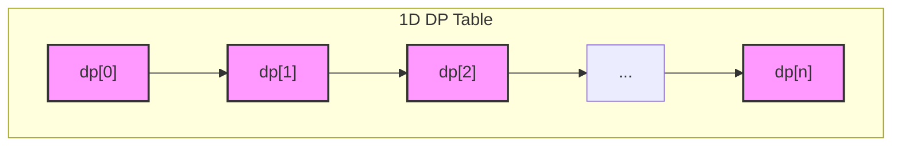

### `array_string`
**Array & String Manipulation:** Problems focused on operations involving arrays and strings, such as searching, sorting, reversing, and other transformations.

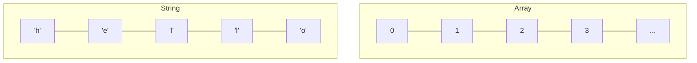

### `backtracking`
**Backtracking:** A general algorithmic technique for solving problems recursively by trying to build a solution incrementally. When a path is determined to be incorrect, the algorithm "backtracks" to a previous state to explore a different path. It's often used for constraint satisfaction problems like puzzles or generating combinations and permutations.

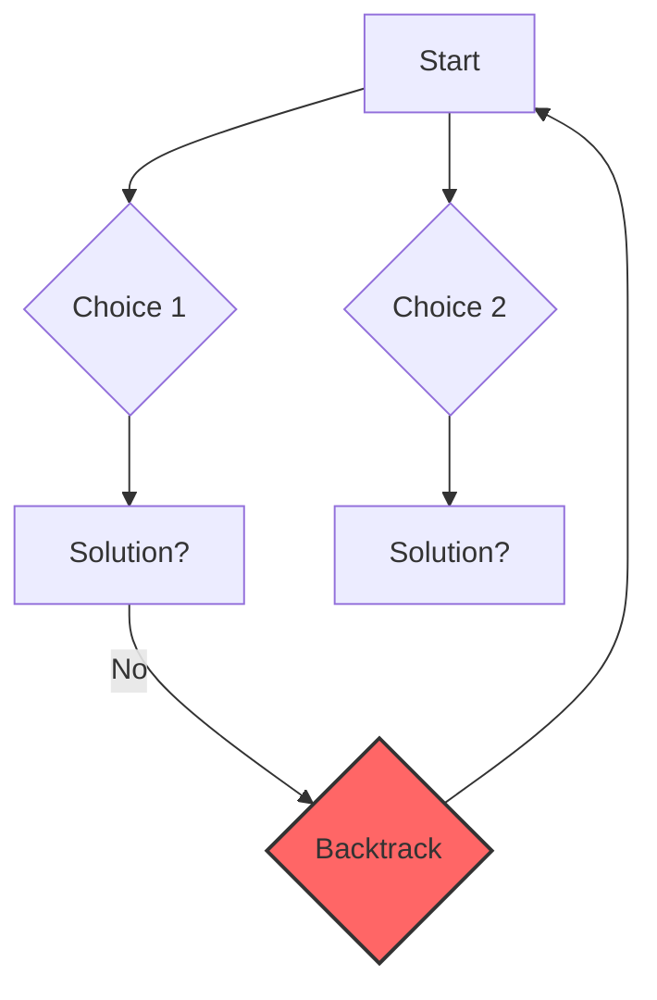

### `binary_search`
**Binary Search:** An efficient algorithm for finding an item from a sorted list of items. It works by repeatedly dividing the search interval in half.

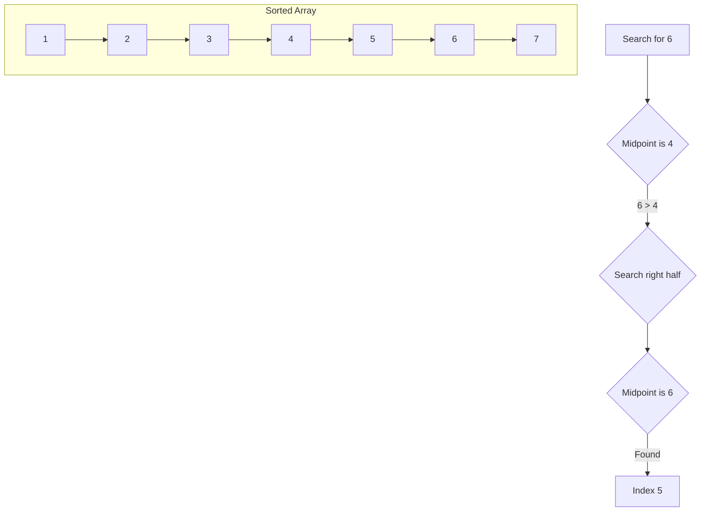

### `binary_search_tree`
**Binary Search Tree (BST):** A node-based binary tree data structure which has the following properties: the left subtree of a node contains only nodes with keys lesser than the node's key; the right subtree of a node contains only nodes with keys greater than the node's key; the left and right subtree each must also be a binary search tree.

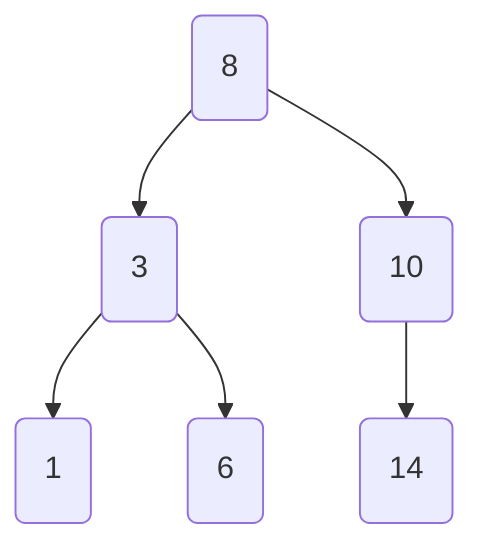

### `binary-tree-bfs`
**Binary Tree - Breadth-First Search (BFS):** An algorithm for traversing or searching tree or graph data structures. It starts at the tree root and explores all of the neighbor nodes at the present depth prior to moving on to the nodes at the next depth level.

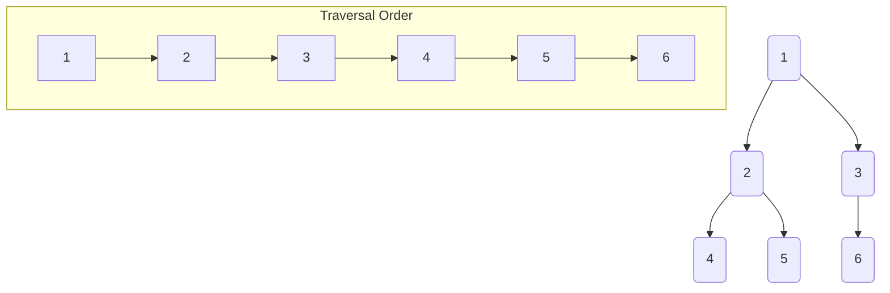

### `binary-tree-dfs`
**Binary Tree - Depth-First Search (DFS):** An algorithm for traversing or searching tree or graph data structures. The algorithm starts at the root node and explores as far as possible along each branch before backtracking.

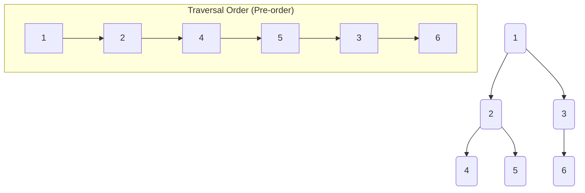

### `binary-tree-general`
**General Binary Tree:** Problems related to the structure, traversal, and manipulation of binary trees that don't fall into a more specific category like BFS, DFS, or BST.

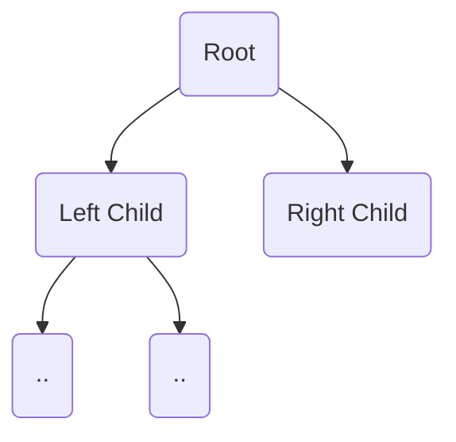

### `bit_manipulation`
**Bit Manipulation:** Problems that are solved by manipulating individual bits of a number using bitwise operators (AND, OR, XOR, NOT, shifts). This is often used for optimization or solving problems with specific constraints.

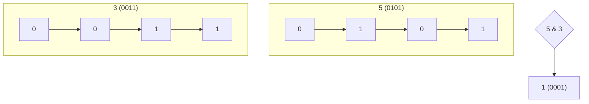

### `divide_conquer`
**Divide and Conquer:** An algorithmic paradigm where a problem is recursively broken down into two or more sub-problems of the same or related type, until these become simple enough to be solved directly. The solutions to the sub-problems are then combined to give a solution to the original problem.

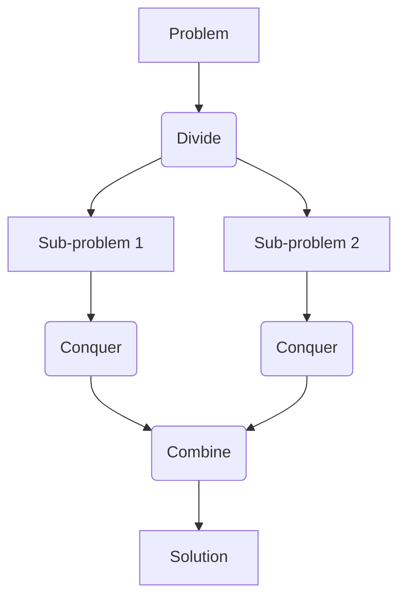

### `dp_multidimensional`
**Multidimensional Dynamic Programming:** An extension of 1D DP where the problem state is represented by two or more dimensions, requiring a 2D or higher-dimensional table to store the results of subproblems.

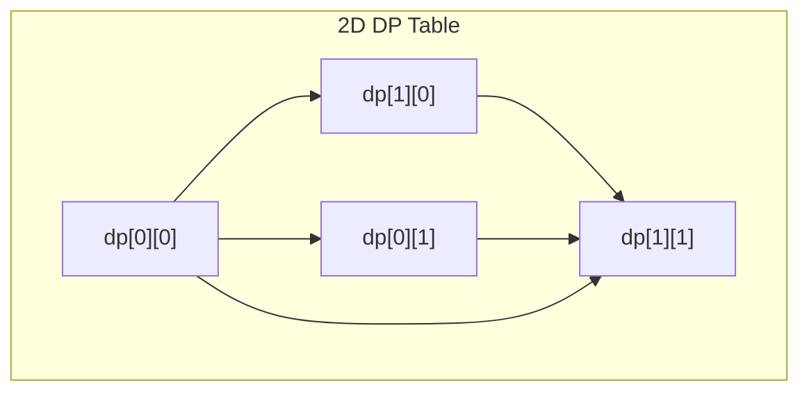

### `graph_bfs`
**Graph - Breadth-First Search (BFS):** The application of BFS to graph data structures to find shortest paths in unweighted graphs or to simply traverse the graph level by level.

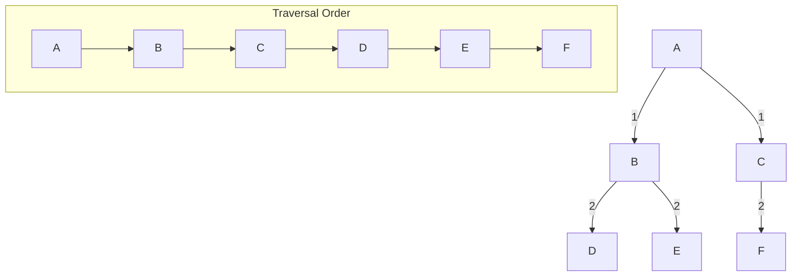

### `graph_dfs`
**Graph - Depth-First Search (DFS):** The application of DFS to graph data structures to explore all vertices and edges, detect cycles, or find connected components.

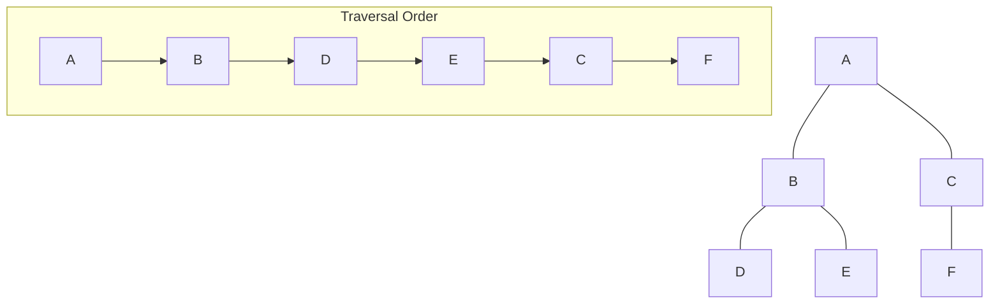

### `graph_general`
**General Graph:** A collection of problems involving graph data structures that may require a combination of algorithms or have unique traversal or structural challenges.

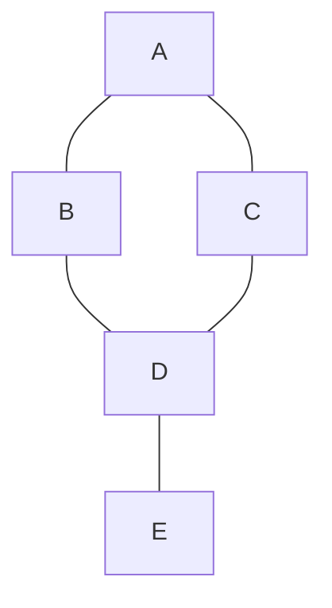

### `hashmap`
**Hash Map (Hash Table):** Problems that can be efficiently solved using a hash map to store key-value pairs. This is useful for quick lookups, counting occurrences, or grouping items.

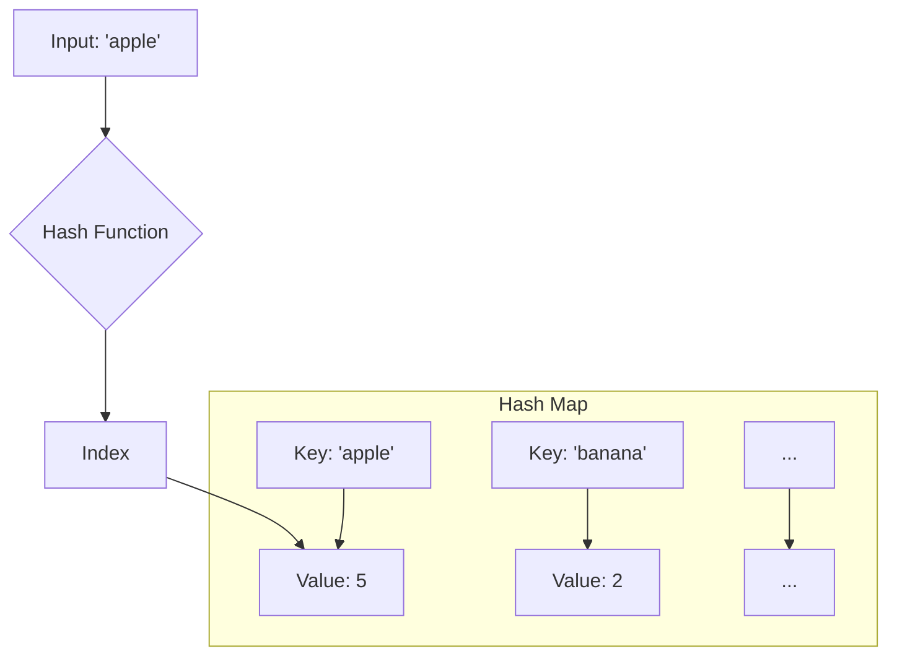

### `heap`
**Heap (Priority Queue):** Problems involving a specialized tree-based data structure that satisfies the heap property. Heaps are useful for implementing priority queues, which are essential for algorithms like Dijkstra's or for finding the k-th smallest/largest element.

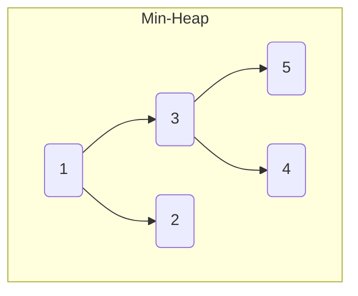

### `intervals`
**Intervals:** A category of problems that involve dealing with ranges or intervals. Common tasks include merging overlapping intervals, finding intersections, or scheduling.

```mermaid
gantt
    title Merging Overlapping Intervals
    dateFormat  X
    axisFormat %s
    section Intervals
    [1, 3] : 1, 3
    [2, 6] : 2, 6
    [8, 10] : 8, 10
    section Merged
    [1, 6] : 1, 6
    [8, 10] : 8, 10
```

### `kadane_algorithm`
**Kadane's Algorithm:** An efficient algorithm used to find the maximum subarray sum in a given one-dimensional array of numbers.

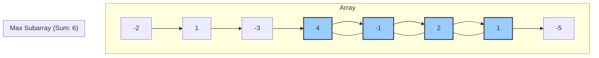

### `linked_list`
**Linked List:** Problems focused on the linked list data structure, including operations like insertion, deletion, reversal, cycle detection, and merging.

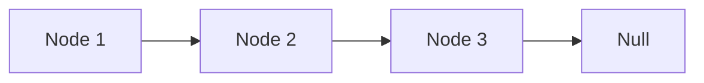

### `math_leetcode`
**Math:** Problems that require mathematical concepts and logic, such as number theory, geometry, or probability, rather than complex data structures.

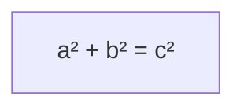

### `matrix`
**Matrix:** Problems that involve operations on 2D grids or matrices, such as rotation, searching, or dynamic programming on a grid.

```mermaid
graph TD
    subgraph "3x3 Matrix"
        A1["[0,0]"] --> A2["[0,1]"]
        A2 --> A3["[0,2]"]

        B1["[1,0]"] --> B2["[1,1]"]
        B2 --> B3["[1,2]"]

        C1["[2,0]"] --> C2["[2,1]"]
        C2 --> C3["[2,2]"]
    end
```

### `monotonic_stack`
**Monotonic Stack:** A stack data structure where the elements are always in a sorted order (either increasing or decreasing). It's useful for problems where you need to find the next greater/smaller element for each element in an array.

```mermaid
graph TD
    subgraph "Increasing Stack (Bottom to Top)"
        direction BT
        A[1] --> B[3] --> C[5] --> D[8]
    end
```

### `prefix_sum`
**Prefix Sum:** A technique where a new array is pre-calculated, and each element `i` in this new array stores the sum of all elements up to index `i` in the original array. This allows for constant-time calculation of the sum of any subarray.

```mermaid
graph TD
    subgraph "Original Array"
        direction LR
        A[2] --> B[8]
        B --> C[3]
        C --> D[5]
    end

    subgraph "Prefix Sum Array"
        direction LR
        PA[2] --> PB[10]
        PB --> PC[13]
        PC --> PD[18]
    end
```

### `queue`
**Queue:** Problems that utilize the First-In, First-Out (FIFO) nature of the queue data structure, often used in BFS or for simulating processes.

```mermaid
graph LR
    A(In) --> B[Front ... Rear] --> C(Out)
    style B fill:#ccf,stroke:#333,stroke-width:2px
```

### `sliding_window`
**Sliding Window:** An algorithmic technique used on arrays or strings where a "window" of a certain size slides over the data. It's used to efficiently solve problems that require finding a subarray or substring that satisfies certain conditions.

```mermaid
graph TD
    subgraph Array
        direction LR
        A[1] --> B[2]
        B --> C[3]
        C --> D[4]
        D --> E[5]
    end

    subgraph "Window (Size 3)"
        direction LR
        style B fill:#f99,stroke:#333,stroke-width:2px
        style C fill:#f99,stroke:#333,stroke-width:2px
        style D fill:#f99,stroke:#333,stroke-width:2px
        B --> C
        C --> D
    end
```

### `stack`
**Stack:** Problems that are naturally solved using the Last-In, First-Out (LIFO) property of the stack data structure, such as validating parentheses, expression evaluation, or simplifying paths.

```mermaid
graph TD
    A(Push) --> B[Top ... Bottom]
    B --> C(Pop)
    style B fill:#cfc,stroke:#333,stroke-width:2px
```

### `trie`
**Trie (Prefix Tree):** A tree-like data structure that is efficient for storing and retrieving strings. It's commonly used for implementing autocomplete features or as a spell checker.

```mermaid
graph TD
    A(root) --> B(t);
    B --> C(o);
    A --> D(a);
    D --> E(n);
    C -- "word: to" --> F(( ));
    E -- "word: an" --> G(( ));
```

### `two_pointer`
**Two Pointers:** A common technique for searching or manipulating sorted arrays. It involves using two pointers that typically move towards each other or in the same direction to solve a problem in linear time.

```mermaid
graph TD
    subgraph Array
        direction LR
        A[1] --> B[2] --> C[3] --> D[4] --> E[5] --> F[6]
    end
    subgraph Pointers
        Left --> A
        Right --> F
    end
    Left -- moves right --> Right
    Right -- moves left --> Left
```